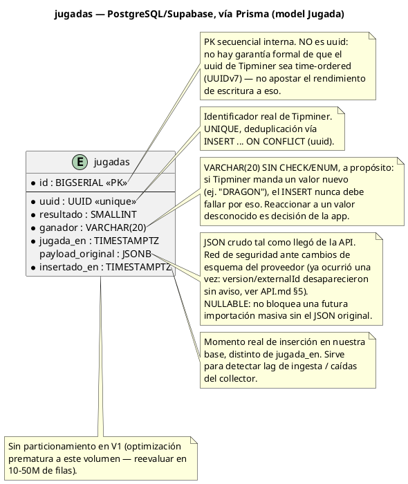

# DATABASE.md — Guía de la base de datos (PostgreSQL / Supabase)

> Estado al 2026-09-08: **seis tablas reales** en la base.
>
> - `jugadas` (migración `20260806040514_init_jugadas`, §4) — fuente de verdad, la escribe `Mk-Ingestion-Service`.
> - `report_checkpoints` (`20260905212238_add_report_checkpoints`, §10) — la puebla `ReportCheckpointScheduler`/`SummaryReportService`.
> - `columnas`, `racha3_operaciones`, `analytics_checkpoints`, `analytics_ejecuciones` (§11) — dominio derivado de Analytics "Racha 3", más 1 vista y 17 funciones SQL.
>
> Este documento reemplaza al análisis previo (`SCHEMA_JUGADAS.md`, ya retirado): es la referencia única, actualizada, tanto para entender el diseño como para conectarse y consultar los datos. La **semántica** del dominio de Analytics vive en [`ANALYTICS.md`](./ANALYTICS.md); acá va el esquema.


---

## 1. Qué es esto

- **Motor**: PostgreSQL, alojado en **Supabase**.
- **ORM/cliente**: **Prisma** (`@prisma/client` 6.19.3).
- **Rol dentro del proyecto**: capa de persistencia **desacoplada** del motor de eventos (`core/`/`application/`). No participa del flujo Strategy→Operation→Notification y no lo puede tumbar. Guarda el historial real de rondas de BacBo (Tipminer/Evolution) en la tabla `jugadas`, que es la fuente de verdad del dominio de Analytics (ver `ANALYTICS.md`).
- **Quién escribe en `jugadas`**: **`Mk-Ingestion-Service`**, un servicio aparte (repositorio propio), que inserta por lotes con `createMany({ skipDuplicates: true })` — es decir `ON CONFLICT (uuid) DO NOTHING`. `Mk-Backend` **no escribe** en esta tabla: verificado por grep, no hay una sola llamada a `prisma.jugada.*` en `src/`. Su `GameEventCollector` sigue manteniendo solo la ventana en memoria de 200 jugadas (`HistoryStore`), que es lo que consume el motor de alertas.
- **Tablas de la base**: `jugadas` (§4), `report_checkpoints` (§10) y las cuatro derivadas de Analytics (§11).

---

## 2. Cómo funciona la conexión (código)

Archivos relevantes: `src/infrastructure/persistence/prisma.service.ts` y `persistence.module.ts`.

```
AppModule
  └── PersistenceModule
        └── PrismaService (Injectable, OnModuleInit, OnModuleDestroy)
              ├── onModuleInit()  → si no hay DATABASE_URL: WARN y queda deshabilitado (no lanza)
              │                   → si hay DATABASE_URL: new PrismaClient({ datasourceUrl }) + $connect()
              │                   → si falla la conexión: ERROR loggeado, queda deshabilitado (no lanza)
              ├── onModuleDestroy() → $disconnect() si había cliente
              ├── checkHealth()   → SELECT 1, nunca lanza, devuelve { ok, latencyMs?, error? }
              └── getClient()     → devuelve el PrismaClient real, o lanza si no está disponible
```

- **Nunca puede tumbar el motor**: si `DATABASE_URL`/`DIRECT_URL` no están definidas, o Supabase no responde, el bot de detección de rachas/alertas sigue funcionando exactamente igual — la persistencia simplemente queda apagada.
- **Variables de entorno** (ver `.env.example`):
  - `DATABASE_URL` — conexión **pooled** (pgbouncer, modo transacción, puerto **6543**). La usa la app en runtime (vía `PrismaClient`).
  - `DIRECT_URL` — conexión **directa/session-mode** (puerto **5432**). La usa **Prisma Migrate**; no la usa `PrismaService` en runtime.
- **Cómo usarlo desde un servicio nuevo**: importar `PersistenceModule` e inyectar `PrismaService`, luego `prismaService.getClient().jugada.create({ data: { ... } })`. `getClient()` lanza con un mensaje claro si la persistencia no está disponible, en vez de fallar en silencio más adelante.

### Scripts disponibles (`package.json`)

| Comando | Qué hace |
|---|---|
| `pnpm db:generate` | Regenera el cliente de Prisma a partir de `prisma/schema.prisma`. |
| `pnpm db:migrate:dev` | Crea y aplica una nueva migración en desarrollo. |
| `pnpm db:migrate:deploy` | Aplica migraciones pendientes en producción. |
| `pnpm db:studio` | Abre **Prisma Studio** (interfaz web local) contra la base configurada. |

---

## 3. Cómo conectarse por terminal (para ver los datos y hacer consultas)

### Opción A — Prisma Studio (más simple)

```bash
pnpm db:studio
```

Abre una interfaz web local (por defecto `http://localhost:5555`) para navegar la tabla `jugadas` sin escribir SQL.

### Opción B — `psql` directo

```bash
# Lee el valor real desde tu .env (nunca lo hardcodees en la terminal ni en scripts versionados)
psql "$DIRECT_URL"
```

Comandos básicos ya verificados contra la base real:

```sql
\dt                                                            -- listar tablas (debe mostrar "jugadas")
\d jugadas                                                     -- columnas, tipos e índices reales
SELECT count(*) FROM jugadas;                                  -- total de filas
SELECT * FROM jugadas ORDER BY id DESC LIMIT 20;                -- últimas 20 jugadas insertadas
SELECT ganador, count(*) FROM jugadas GROUP BY ganador;         -- distribución PLAYER/BANKER/TIE
SELECT * FROM jugadas WHERE jugada_en > now() - interval '1 hour' ORDER BY jugada_en DESC; -- última hora
```

### Opción C — Panel de Supabase (SQL Editor)

`Project → SQL Editor` en el dashboard de Supabase corre las mismas consultas sin `psql` local. Credenciales en `Project Settings → Database → Connection string` (igual que `.env.example`).

**Seguridad**: nunca pegues `DATABASE_URL`/`DIRECT_URL` completas (con contraseña real) en chats, tickets o documentación. Usa siempre la cuenta corporativa aprobada para acceder al panel de Supabase de este proyecto.

---

## 4. Esquema real de `jugadas` (implementado, migración `20260806040514_init_jugadas`)

```
┌──────────────────────────────────────────────────────┐
│                       jugadas                         │
├──────────────────────────────────────────────────────┤
│ id                 BIGSERIAL     PK, secuencial       │
│ uuid               UUID          UNIQUE, NOT NULL     │
│ resultado          SMALLINT      NOT NULL             │
│ ganador            VARCHAR(20)   NOT NULL, sin CHECK  │
│ jugada_en          TIMESTAMPTZ   NOT NULL             │
│ payload_original   JSONB         NULL (a propósito)   │
│ insertado_en       TIMESTAMPTZ   NOT NULL, DEFAULT now()│
└──────────────────────────────────────────────────────┘

Índices reales:
  UNIQUE (uuid)
  INDEX  (jugada_en DESC)
  INDEX  (ganador, jugada_en)
```

Diagrama PlantUML (fuente del PNG embebido arriba — cópialo en [plantuml.com](https://plantuml.com) si necesitas regenerarlo):



---

## 5. Detalle de cada campo

| Campo | Tipo | Nullable | Campo API correspondiente | Por qué |
|---|---|---|---|---|
| `id` | `BIGSERIAL` | No (PK) | — (interno) | Secuencial por construcción, independiente del formato real de `uuid`. |
| `uuid` | `UUID` | No (`UNIQUE`) | `uuid` | Identificador de la ronda según Tipminer. Defensa real contra duplicados (SSE + historial reintentando la misma ronda) vía `ON CONFLICT (uuid) DO NOTHING`. |
| `resultado` | `SMALLINT` | No | `result` | Suma de 2 dados. Rango teórico 2-12 (observado en vivo 4-12). |
| `ganador` | `VARCHAR(20)` | No | `type` | Sin `CHECK`/`ENUM` a propósito — tolerancia ante un valor nuevo de un proveedor externo no confiable. Valores reales hoy: `PLAYER`/`BANKER`/`TIE`. |
| `jugada_en` | `TIMESTAMPTZ(3)` | No | `instant` | Momento UTC real de la ronda. Siempre con milisegundos y sufijo `Z` en la API. |
| `payload_original` | `JSONB` | **Sí, a propósito** | payload crudo completo | Red de seguridad ante cambios de esquema de la API. Nullable para no bloquear una futura importación masiva sin el JSON original. |
| `insertado_en` | `TIMESTAMPTZ(3)` | No | — (interno) | `DEFAULT now()`. No viene de la API: mide lag de ingesta / caídas del collector. |

**Evaluados y descartados explícitamente** (no solo "omitidos"): `version` y `externalId` — documentados alguna vez por la API pero ausentes en la práctica desde al menos 2026-08-06 (ver `API.md` §5), y `version` resultó ser un contador por mesa, no global, así que tampoco tenía el valor esperado. `source` (qué cliente originó la fila, `/history` vs. `/live`) — descartado porque solo habrá un servicio de ingesta poblando la tabla.

**Campos de la API que nunca llegan a esta tabla**: metadata del juego/casino (`logo`, `displayName`, `country`, `description`, `referral`, timestamps de administración del catálogo) obtenida de `/v1/casinos`/`/v1/games/status` — describe *dónde se juega*, no *lo que ocurrió en una ronda*; es redundante (el mismo `provider` de Bac Bo aparece repetido en 6+ marcas de casino distintas) y no aporta nada al análisis de patrones. Si algún día hace falta, vive en una tabla `mesas`/`proveedores` separada, no en `jugadas`.

---

## 6. Decisiones de diseño clave (por qué se descartaron las alternativas)

- **PK interna (`BIGSERIAL`) en vez de `uuid`**: la tabla crece 24/7 sin parar durante años; una PK secuencial es siempre eficiente para inserción append-only. No apostar esa performance a que el `uuid` de un proveedor externo sea time-ordered, aunque la evidencia (prefijos consistentes con el paso del tiempo) lo sugiera — nunca se confirmó formalmente.
- **`ganador VARCHAR(20)` sin `CHECK`, no `ENUM`**: la base de datos debe tolerar un valor nuevo del proveedor sin que el `INSERT` falle. Un `ENUM` nativo de Postgres es costoso de ampliar/reducir con millones de filas ya insertadas; un `CHECK` también bloquearía el insert ante un valor no previsto.
- **`payload_original` nullable, no `NOT NULL`**: para no bloquear una futura importación masiva desde otra fuente que solo tenga los campos ya normalizados.
- **Sin particionamiento en V1**: optimización prematura a este volumen — se reevalúa en el orden de 10-50 millones de filas, no antes.
- **`version`/`externalId`/`source` fuera del esquema**: ver la tabla de la sección 5. Si en el futuro `version`/`externalId` reaparecen en la API y resultan útiles, agregarlos de vuelta (nullable) es una migración barata — no es una puerta cerrada, solo no se paga el costo hoy sin un caso de uso claro.

---

## 7. Riesgos conocidos

- **El esquema de la API cambia sin aviso — ya ocurrió una vez.** `version`/`externalId` estaban documentados en `API.md` el 2026-08-01 y habían desaparecido de la respuesta real el 2026-08-06 (ver `API.md` §5). Ninguna columna nueva que dependa de la API debe asumirse estable sin verificarla en vivo primero.
- **Duplicados por reconexión SSE + reintentos de historial**: la misma ronda puede llegar por dos vías. Mitigado con `UNIQUE (uuid)` + `ON CONFLICT (uuid) DO NOTHING` al insertar (a implementar en el futuro servicio de ingesta).
- **Inmutabilidad de rondas ya publicadas**: observada (0 cambios en ~198 filas repetidas entre llamadas durante la verificación), pero no es una garantía contractual de Tipminer.
- **Un `ganador` no contemplado en el futuro** no rompe el `INSERT` (por diseño, ver §6), pero sí requiere que la capa de aplicación decida cómo reaccionar — ver preguntas abiertas.

---

## 8. Preguntas todavía abiertas

1. **Política de retención**: ¿crecimiento ilimitado, o archivado/purga después de cierto tiempo?
2. **Qué hacer ante un `ganador` no contemplado**: ¿columna/flag de "revisar", alerta activa, o confiar en que sea visible al consultar por su valor literal?
3. **Concurrencia de escritores**: cuando coexistan un proceso de backfill/reconexión (`/history`) y uno en vivo (`/live`) escribiendo a `jugadas`, ¿alcanza `UNIQUE (uuid)` para serializar conflictos, o hace falta algo más?

---

## 9. Próximos pasos

1. Resolver (o aceptar posponer) las preguntas de §8 — ninguna bloquea el uso actual de la tabla.
2. ~~Implementar el servicio real de captura que inserte en `jugadas`~~ — **hecho**: lo hace `Mk-Ingestion-Service` (ver §1). La pregunta 3 de §8 (concurrencia de escritores) quedó resuelta por la vía de tener un escritor único, no por el `UNIQUE (uuid)`.
3. **Riesgo abierto (no de esquema, sino de conexión)**: `PrismaService` conecta una única vez en `onModuleInit` y no reintenta; si Supabase no responde justo en ese instante, la persistencia queda deshabilitada para toda la vida del proceso. Se observaron ~8 cortes esporádicos del pooler (`P1001`) en una sola sesión de trabajo. Afecta a Analytics y a Reporting por igual — ver `ANALYTICS.md` §11.2.
4. Mantener este documento como referencia única de la base de datos — si el esquema cambia, actualizar aquí, no crear un documento de análisis paralelo. La **semántica** del dominio de Analytics (qué es una Racha 3, qué significa cada bandera) vive en `ANALYTICS.md`; acá va solo el esquema.

---

## 10. `report_checkpoints` (implementada, migración `20260905212238_add_report_checkpoints`)

Resuelve un problema real de `SummaryReportService`/`GET /api/v1/reports/summary` (§4.10 de `documentacion_mk_api.md`): `won`/`lost`/`alertsSent`/`uptimeMs` viven en memoria (`InMemoryOperationReportStore`), así que un reinicio o redeploy del proceso (Vercel, Railway, o simplemente reiniciar `pnpm start:prod`) los vuelve a cero. Esta tabla guarda un **checkpoint periódico** de esos contadores para que el motor pueda "retomar donde iba" al arrancar de nuevo.

```
┌──────────────────────────────────────────────────────┐
│                report_checkpoints                     │
├──────────────────────────────────────────────────────┤
│ channel            VARCHAR(20)   PK ("oficial"/"pruebas")│
│ won                INTEGER       NOT NULL, DEFAULT 0  │
│ lost               INTEGER       NOT NULL, DEFAULT 0  │
│ alerts_sent        INTEGER       NOT NULL, DEFAULT 0  │
│ first_started_at   TIMESTAMPTZ   NOT NULL             │
│ updated_at         TIMESTAMPTZ   NOT NULL             │
└──────────────────────────────────────────────────────┘
```

- **Una fila por canal** (`oficial`/`pruebas`, ver `StrategyGroup`) — como máximo 2 filas.
- **`first_started_at` se fija una única vez**, al crear la fila (`INSERT`), y nunca se vuelve a escribir en los `UPDATE` posteriores (ver `PrismaReportCheckpointStore.save`, que separa `create`/`update` explícitamente en el `upsert`). Es lo que permite que `uptimeMs` refleje tiempo acumulado real entre despliegues, no solo desde el último reinicio del proceso.
- **Deliberadamente mínima** — mismo criterio que `jugadas` (§6): solo los 3 contadores agregados que expone la API pública (`won`, `lost`, `alertsSent`), nunca el detalle de cada `Operation` (rachas, distribución directa/MG1/MG2, martingalas usadas, horas destacadas — ver `SummaryMetricsSnapshot`). Ese detalle fino se sigue calculando solo en memoria durante la vida de cada proceso, desde `InMemoryOperationReportStore`, y **no sobrevive** un reinicio — solo won/lost/alertsSent/uptime lo hacen.

**Cómo se escribe y se lee (código relevante):**

| Pieza | Rol |
|---|---|
| `core/reporting/interfaces/report-checkpoint-store.interface.ts` | Contrato `ReportCheckpointStore` (`loadAll`/`save`), puro TypeScript — `core/` nunca importa Prisma. |
| `infrastructure/persistence/prisma-report-checkpoint-store.ts` | Implementación real (`PrismaReportCheckpointStore`). Nunca lanza: si Supabase no está disponible, `loadAll()` devuelve `[]` y `save()` solo loguea un `warn` — el motor sigue funcionando exactamente igual, sin checkpoint, mismo criterio que `PrismaService`. |
| `application/reporting/summary-report.service.ts` | `hydrateFromCheckpoint()` carga el offset al arrancar; `persistCheckpoint()` guarda el acumulado actual (offset + lo ocurrido en memoria desde que arrancó este proceso); `getSnapshot()`/`generateAndDispatch()` ya devuelven won/lost/alertsSent/uptimeMs **combinados** con ese offset. |
| `application/reporting/report-checkpoint.scheduler.ts` | `ReportCheckpointScheduler`: guarda el checkpoint cada `REPORT_CHECKPOINT_INTERVAL_MS` (default 10 minutos, `.env.example`) vía `setInterval` — intervalo puramente técnico, no alineado a ninguna hora de reloj (a diferencia de `ReportScheduler`, el reporte horario). |
| `main.ts` | Llama `summaryReportService.hydrateFromCheckpoint()` explícitamente, después de `app.listen()` pero **antes** de `GameEventCollector.start()` — mismo criterio documentado en `ARCHITECTURE.md` §8 para el propio collector: así ninguna operación real puede cerrarse y contarse antes de que el offset esté cargado. |

**Qué pasa sin `DATABASE_URL`/`DIRECT_URL` configuradas, o si Supabase está caído**: exactamente el comportamiento actual, sin checkpoint — `hydrateFromCheckpoint()` no encuentra filas (offset en cero) y `persistCheckpoint()` no logra nada (solo un `warn` en el log cada intento); el motor de detección de rachas/alertas nunca depende de esta tabla para funcionar.

```sql
SELECT * FROM report_checkpoints;                          -- estado actual de ambos canales
SELECT won, lost, alerts_sent FROM report_checkpoints WHERE channel = 'oficial';
```

---

## 11. Tablas derivadas de Analytics "Racha 3" (implementadas)

Migraciones: `20260907234500_analytics_racha3_base` (tablas, índices, constraints, FKs), `20260908000500_analytics_racha3_motor` (rebuild/incremental/validar), `20260908020000_analytics_racha3_agregaciones` (vista + 10 funciones de lectura), `20260908030000_analytics_racha3_validar_corte` (corrección del validador) y `20260908040000_analytics_racha3_estado_distancia` (2 funciones de estado).

**La semántica del dominio no está acá, está en [`ANALYTICS.md`](./ANALYTICS.md)**: qué es una Racha 3, qué es una columna, por qué el umbral de gap es 120000 ms, qué significan `bloqueada_por_operacion_previa` e `integridad_ok`, cómo se interpreta cada estadística. Esta sección documenta únicamente el **esquema**.

### 11.1 Principios que gobiernan estas cuatro tablas

1. **`jugadas` es la única fuente de verdad y nunca se modifica.** Ninguna migración de Analytics le agrega columnas, índices ni constraints. Las relaciones inversas que aparecen en `schema.prisma` (`Jugada.columnasIniciadas`, `Jugada.racha3ComoInicio`, etc.) son campos **virtuales** de Prisma, sin representación física: existen sólo porque Prisma exige declarar ambos extremos de una relación para que las FKs del lado hijo no se consideren drift.
2. **Todo lo demás es derivado y descartable.** `TRUNCATE racha3_operaciones, columnas RESTART IDENTITY` debe poder ejecutarse en cualquier momento sin pérdida de información real.
3. **Las claves de idempotencia no son secuencias**, son claves naturales derivadas de `jugadas`: `columnas.inicio_jugada_id` UNIQUE y `racha3_operaciones.columna_id` UNIQUE. Reejecutar el mismo rango no puede duplicar nada porque esas claves sólo dependen de una tabla inmutable.
4. **Los `id` de `columnas` y `racha3_operaciones` son efímeros.** Un rebuild los reinicia y el incremental los rota en el tramo rebobinado (usa DELETE + INSERT). Nada fuera de este dominio debe tratarlos como identidad estable.
5. **`jugadas.id` no es contiguo** (579 valores consumidos sin fila, por el `ON CONFLICT DO NOTHING` del batcher de ingesta). Todo recorrido derivado es `id > checkpoint ORDER BY id`; **`id BETWEEN a AND b` está prohibido en este dominio**.

### 11.2 `columnas`

Corridas continuas *observadas* del mismo ganador. `PLAYER`, `BANKER` y `TIE` son tipos independientes.

| Columna | Tipo | Notas |
|---|---|---|
| `id` | `BIGSERIAL` PK | Efímero (ver 11.1.4) |
| `tipo` | `VARCHAR(20)` | Copia de `jugadas.ganador`. **Sin `CHECK`**, mismo criterio que `jugadas.ganador`: un valor nuevo del proveedor nunca debe abortar un rebuild completo. La protección real es el filtro positivo `tipo IN ('PLAYER','BANKER')` al generar oportunidades |
| `longitud` | `INTEGER` | `CHECK (longitud >= 1)` |
| `inicio_jugada_id` | `BIGINT` UNIQUE, FK → `jugadas` | **Clave natural de idempotencia** |
| `fin_jugada_id` | `BIGINT` FK → `jugadas` | `CHECK (fin >= inicio)` |
| `inicio_en` / `fin_en` | `TIMESTAMPTZ(3)` | Desnormalización deliberada de `jugadas.jugada_en`: evita un JOIN en toda agregación temporal y son inmutables porque `jugadas` es append-only |
| `corte_por_gap` | `BOOLEAN` | Empieza por discontinuidad temporal, no por cambio de ganador → longitud posiblemente truncada por la izquierda |
| `cerrada_por_gap` | `BOOLEAN` | La siguiente empieza por gap → truncada por la derecha. Es el dato que necesitará el futuro concepto "L" (columna P/B de longitud ≥ 6) |

Índices: `UNIQUE(inicio_jugada_id)` · `(tipo, longitud)` (soporta el futuro "L") · `(fin_jugada_id)`.

**No existe una columna `cerrada`**: sería estado redundante, porque la única columna extensible es siempre `max(id)`, y el punto de rebobinado del incremental ya la cubre por construcción.

### 11.3 `racha3_operaciones`

Una fila por oportunidad Racha 3, con su operación simulada en la misma fila. Relación **1:1 estricta** con `columnas`.

**Anclaje a `jugadas` por FK, nunca por listas JSON de uuids** — los uuid originales se recuperan con un JOIN, sin duplicar el dato:

| Columna | Notas |
|---|---|
| `columna_id` | `BIGINT` UNIQUE, FK → `columnas` `ON DELETE CASCADE`. **Clave natural de idempotencia** |
| `jugada_inicio_id` | 1.ª jugada de la corrida |
| `jugada_confirmacion_id` | 3.ª jugada consecutiva. UNIQUE: red de seguridad frente a un bug que produjera dos oportunidades confirmadas en la misma jugada |
| `jugada_directa_id` / `jugada_mg1_id` / `jugada_mg2_id` | Escalera de martingala. `NULL` = nivel no alcanzado. **Los TIE no ocupan estos slots** (son neutrales); su cantidad va en `ties_en_operacion` |
| `jugada_resolucion_id` | Redundante con `COALESCE(mg2, mg1, directa)` por diseño, con un `CHECK` que lo impone |

Estado y resultado: `estado` (`PENDIENTE` \| `RESUELTA`) · `resultado_final` (`DIRECTA` \| `MG1` \| `MG2` \| `LOSS`) · `max_martingalas` (`SMALLINT`, default 2).

`max_martingalas` se persiste **por operación** porque en el motor es mutable en runtime vía API (`StrategyConfigProvider`): sin esta columna, un cambio de configuración invalidaría en silencio todo el histórico.

Instantes: `inicio_en` · `confirmacion_en` · `resuelta_en`.

Derivados: `duracion_ms` · `jugadas_evaluadas` (incluye TIEs) · `ties_en_operacion` · `jugadas_desde_anterior` · `columnas_desde_anterior` · `segundos_desde_anterior`.

> `segundos_desde_anterior` está **truncado**, no redondeado ("segundos completos transcurridos"). `EXTRACT(epoch …)::integer` redondea en PostgreSQL y `Math.trunc` no: esa asimetría produjo 2.086 diferencias en la primera verificación cruzada TS↔SQL. La precisión exacta vive en `duracion_ms` y en los propios `timestamptz`.

Hora Colombia: `hora_col_inicio` · `hora_col_confirmacion` · `hora_col_resolucion` (`SMALLINT` 0-23).

> Son **columnas normales, no generadas**. `AT TIME ZONE` con nombre de zona es `STABLE`, no `IMMUTABLE`, así que PostgreSQL prohíbe usarlo en `GENERATED … STORED` o en un índice de expresión. Las escribe la función de procesamiento, y la invariante V10 las recalcula exigiendo 0 diferencias.

Banderas de calidad: `bloqueada_por_operacion_previa` (default `false`) · `integridad_ok` (default `true`). Semántica en `ANALYTICS.md` §1.5 y §1.6.

Metadato: `procesada_en` — cuándo se recalculó la fila. Es del pipeline, no del juego.

Índices: `UNIQUE(columna_id)` · `UNIQUE(jugada_confirmacion_id)` · `(confirmacion_en DESC)`.

**26 `CHECK` constraints** cubren la coherencia intra-fila: la escalera no puede saltarse niveles; `RESUELTA` implica resultado + instante + jugada de resolución (las tres o ninguna); `apuesta <> tipo_racha`; `jugada_resolucion_id` es exactamente el último nivel alcanzado; `resultado_final` corresponde al nivel realmente alcanzado; horas en 0-23; y todos los derivados de la resolución existen si y sólo si la operación está `RESUELTA`. Lo que un `CHECK` **no** puede verificar — relaciones entre filas y contra `jugadas` — lo cubren las invariantes V0-V11 (`ANALYTICS.md` §8).

**Índices deliberadamente ausentes**: `(resultado_final, tipo_racha)`, `(hora_col_confirmacion)` y un parcial `WHERE estado = 'PENDIENTE'`. Con ~4.100 filas PostgreSQL hace seq scan de todas formas. Además Prisma no puede representar índices parciales, así que crear el último dejaría una diferencia permanente entre base y modelo. Se reevalúan al cruzar ~500k filas o p95 > 200 ms.

### 11.4 `analytics_checkpoints`

Una fila por proceso (`racha3` es el único). **Ausencia de fila = nunca se procesó**, que es un estado legítimo, no un error: la crea el REBUILD.

| Columna | Notas |
|---|---|
| `proceso` | `VARCHAR(40)` PK |
| `ultima_jugada_id` | Marca de agua. **Nunca extremo de un rango cerrado** (ver 11.1.5) |
| `ultima_jugada_en` | Detecta inserciones retroactivas que romperían el orden por id |
| `reproceso_desde_jugada_id` | **Punto de rebobinado seguro**: la menor entre el inicio de la última columna y el inicio de la columna de la operación `PENDIENTE` más antigua. Ambos son inicios de columna, así que el tramo siempre arranca en frontera limpia. `CHECK (reproceso_desde <= ultima_jugada_id)` |
| `ultima_ejecucion_id` | FK → `analytics_ejecuciones` `ON DELETE SET NULL` |
| `actualizado_en` | |

### 11.5 `analytics_ejecuciones`

Bitácora de cada corrida: responde éxito / error / reintento / duplicado sin adivinar.

`id` · `proceso` · `tipo` (`REBUILD` \| `INCREMENTAL`) · `estado` (`OK` \| `ERROR`) · `desde_jugada_id` · `hasta_jugada_id` · `jugadas_leidas` · `columnas_afectadas` · `operaciones_afectadas` · `duracion_ms` · `error` · `iniciado_en` · `terminado_en`. Índice `(proceso, iniciado_en DESC)`.

`CHECK ((estado = 'ERROR') = (error IS NOT NULL))`: un error siempre trae mensaje, un OK nunca lo trae.

**No hay estado `EN_CURSO`**, y no es un olvido: plpgsql no tiene transacciones autónomas, así que una fila escrita al inicio desaparecería en el mismo ROLLBACK que se quiere registrar. Las funciones envuelven el trabajo en `BEGIN … EXCEPTION` (savepoint implícito), capturan el error y recién entonces insertan una única fila con el estado definitivo: el trabajo se revierte, la bitácora sobrevive. Un crash duro no deja fila; la señal ahí es el checkpoint que no avanzó.

### 11.6 Claves foráneas

**8 FKs apuntan a `jugadas`** (2 desde `columnas`, 6 desde `racha3_operaciones`), todas `ON DELETE RESTRICT ON UPDATE CASCADE`. `jugadas` es append-only, así que `RESTRICT` nunca debería dispararse — y ese es justamente el punto: convierte "alguien borró historial" en un error ruidoso en vez de en datos derivados apuntando al vacío.

`racha3_operaciones.columna_id` → `columnas` va `ON DELETE CASCADE`, para que el `TRUNCATE … CASCADE` del REBUILD limpie ambas de un golpe y nunca queden oportunidades huérfanas.

**10 FKs en total.** No se crean índices para las FKs hacia `jugadas` que no tienen ya un UNIQUE: PostgreSQL sólo necesita índice del lado hijo cuando la fila **padre** se borra o actualiza, y en `jugadas` eso no ocurre nunca.

### 11.7 Consultas útiles

```sql
-- estado del pipeline derivado
SELECT * FROM racha3_estado();

-- invariantes del dominio (V0..V11)
SELECT * FROM analytics_racha3_validar();

-- ultimas corridas y como terminaron
SELECT tipo, estado, jugadas_leidas, columnas_afectadas, operaciones_afectadas,
       duracion_ms, error, iniciado_en
  FROM analytics_ejecuciones WHERE proceso = 'racha3'
 ORDER BY iniciado_en DESC LIMIT 10;

-- distribucion de longitudes de columna (base del futuro "L")
SELECT * FROM racha3_columnas_distribucion();

-- una oportunidad con los uuid reales de sus jugadas
SELECT o.id, o.resultado_final,
       ji.uuid AS uuid_inicio, jc.uuid AS uuid_confirmacion, jr.uuid AS uuid_resolucion
  FROM racha3_operaciones o
  JOIN jugadas ji ON ji.id = o.jugada_inicio_id
  JOIN jugadas jc ON jc.id = o.jugada_confirmacion_id
  LEFT JOIN jugadas jr ON jr.id = o.jugada_resolucion_id
 ORDER BY o.confirmacion_en DESC LIMIT 5;
```

Las 17 funciones y la vista `vw_racha3` están catalogadas en `ANALYTICS.md` §6.
