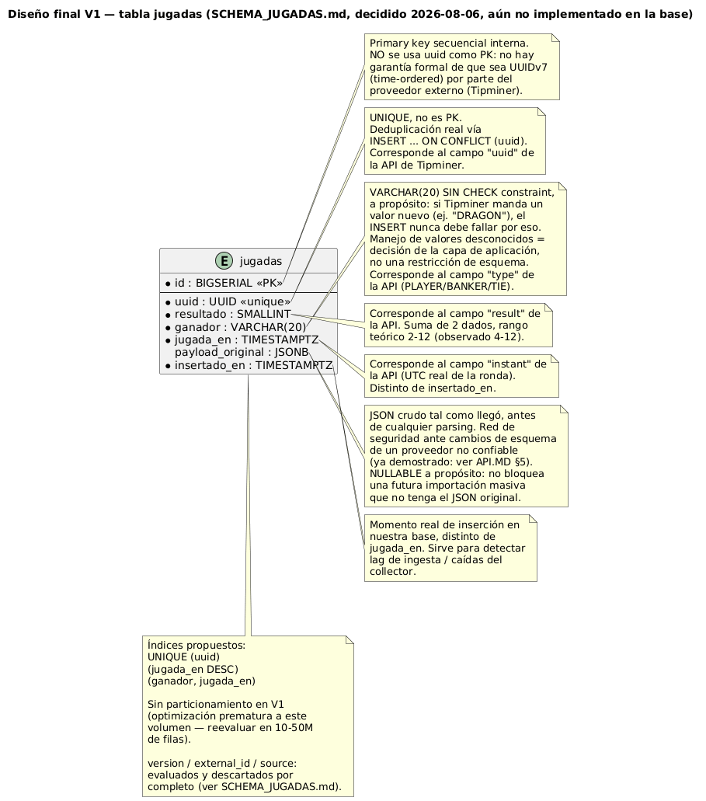

# DATABASE.md — Guía de la base de datos (PostgreSQL / Supabase)

> Estado al 2026-08-06: la infraestructura de conexión (Prisma + Supabase) está implementada y la tabla `jugadas` **ya existe en la base real**, con el esquema descrito abajo (1 migración aplicada, 0 filas — todavía no hay un servicio que la pueble). Este documento reemplaza al análisis previo (`SCHEMA_JUGADAS.md`, ya retirado): es la referencia única, actualizada, tanto para entender el diseño como para conectarse y consultar los datos.



---

## 1. Qué es esto

- **Motor**: PostgreSQL, alojado en **Supabase**.
- **ORM/cliente**: **Prisma** (`@prisma/client` 6.19.3).
- **Rol dentro del proyecto**: capa de persistencia **desacoplada** del motor de eventos (`core/`/`application/`). No participa del flujo Strategy→Operation→Notification y no lo puede tumbar. Guarda el historial real de rondas de BacBo (Tipminer/Evolution) en la tabla `jugadas`, que será la fuente de verdad para el futuro motor de análisis de patrones/probabilidades (ver `ARCHITECTURE.md` §12.2).
- **Qué falta todavía**: un servicio que realmente inserte filas (hoy `GameEventCollector` sigue guardando solo en memoria, vía `HistoryStore`; escribir en `jugadas` es el siguiente paso, no incluido en este documento).

---

## 2. Cómo funciona la conexión (código)

Archivos relevantes: `src/infrastructure/persistence/prisma.service.ts` y `persistence.module.ts`.

```
AppModule
  └── PersistenceModule
        └── PrismaService (Injectable, OnModuleInit, OnModuleDestroy)
              ├── onModuleInit()  → si no hay DATABASE_URL: WARN y queda deshabilitado (no lanza)
              │                   → si hay DATABASE_URL: new PrismaClient({ datasourceUrl }) + $connect()
              │                   → si falla la conexión: ERROR loggeado, queda deshabilitado (no lanza)
              ├── onModuleDestroy() → $disconnect() si había cliente
              ├── checkHealth()   → SELECT 1, nunca lanza, devuelve { ok, latencyMs?, error? }
              └── getClient()     → devuelve el PrismaClient real, o lanza si no está disponible
```

- **Nunca puede tumbar el motor**: si `DATABASE_URL`/`DIRECT_URL` no están definidas, o Supabase no responde, el bot de detección de rachas/alertas sigue funcionando exactamente igual — la persistencia simplemente queda apagada.
- **Variables de entorno** (ver `.env.example`):
  - `DATABASE_URL` — conexión **pooled** (pgbouncer, modo transacción, puerto **6543**). La usa la app en runtime (vía `PrismaClient`).
  - `DIRECT_URL` — conexión **directa/session-mode** (puerto **5432**). La usa **Prisma Migrate**; no la usa `PrismaService` en runtime.
- **Cómo usarlo desde un servicio nuevo**: importar `PersistenceModule` e inyectar `PrismaService`, luego `prismaService.getClient().jugada.create({ data: { ... } })`. `getClient()` lanza con un mensaje claro si la persistencia no está disponible, en vez de fallar en silencio más adelante.

### Scripts disponibles (`package.json`)

| Comando | Qué hace |
|---|---|
| `pnpm db:generate` | Regenera el cliente de Prisma a partir de `prisma/schema.prisma`. |
| `pnpm db:migrate:dev` | Crea y aplica una nueva migración en desarrollo. |
| `pnpm db:migrate:deploy` | Aplica migraciones pendientes en producción. |
| `pnpm db:studio` | Abre **Prisma Studio** (interfaz web local) contra la base configurada. |

---

## 3. Cómo conectarse por terminal (para ver los datos y hacer consultas)

### Opción A — Prisma Studio (más simple)

```bash
pnpm db:studio
```

Abre una interfaz web local (por defecto `http://localhost:5555`) para navegar la tabla `jugadas` sin escribir SQL.

### Opción B — `psql` directo

```bash
# Lee el valor real desde tu .env (nunca lo hardcodees en la terminal ni en scripts versionados)
psql "$DIRECT_URL"
```

Comandos básicos ya verificados contra la base real:

```sql
\dt                                                            -- listar tablas (debe mostrar "jugadas")
\d jugadas                                                     -- columnas, tipos e índices reales
SELECT count(*) FROM jugadas;                                  -- total de filas
SELECT * FROM jugadas ORDER BY id DESC LIMIT 20;                -- últimas 20 jugadas insertadas
SELECT ganador, count(*) FROM jugadas GROUP BY ganador;         -- distribución PLAYER/BANKER/TIE
SELECT * FROM jugadas WHERE jugada_en > now() - interval '1 hour' ORDER BY jugada_en DESC; -- última hora
```

### Opción C — Panel de Supabase (SQL Editor)

`Project → SQL Editor` en el dashboard de Supabase corre las mismas consultas sin `psql` local. Credenciales en `Project Settings → Database → Connection string` (igual que `.env.example`).

**Seguridad**: nunca pegues `DATABASE_URL`/`DIRECT_URL` completas (con contraseña real) en chats, tickets o documentación. Usa siempre la cuenta corporativa aprobada para acceder al panel de Supabase de este proyecto.

---

## 4. Esquema real de `jugadas` (implementado, migración `20260806040514_init_jugadas`)

```
┌──────────────────────────────────────────────────────┐
│                       jugadas                         │
├──────────────────────────────────────────────────────┤
│ id                 BIGSERIAL     PK, secuencial       │
│ uuid               UUID          UNIQUE, NOT NULL     │
│ resultado          SMALLINT      NOT NULL             │
│ ganador            VARCHAR(20)   NOT NULL, sin CHECK  │
│ jugada_en          TIMESTAMPTZ   NOT NULL             │
│ payload_original   JSONB         NULL (a propósito)   │
│ insertado_en       TIMESTAMPTZ   NOT NULL, DEFAULT now()│
└──────────────────────────────────────────────────────┘

Índices reales:
  UNIQUE (uuid)
  INDEX  (jugada_en DESC)
  INDEX  (ganador, jugada_en)
```

Diagrama PlantUML (fuente del PNG embebido arriba — cópialo en [plantuml.com](https://plantuml.com) si necesitas regenerarlo):


---

## 5. Detalle de cada campo

| Campo | Tipo | Nullable | Campo API correspondiente | Por qué |
|---|---|---|---|---|
| `id` | `BIGSERIAL` | No (PK) | — (interno) | Secuencial por construcción, independiente del formato real de `uuid`. |
| `uuid` | `UUID` | No (`UNIQUE`) | `uuid` | Identificador de la ronda según Tipminer. Defensa real contra duplicados (SSE + historial reintentando la misma ronda) vía `ON CONFLICT (uuid) DO NOTHING`. |
| `resultado` | `SMALLINT` | No | `result` | Suma de 2 dados. Rango teórico 2-12 (observado en vivo 4-12). |
| `ganador` | `VARCHAR(20)` | No | `type` | Sin `CHECK`/`ENUM` a propósito — tolerancia ante un valor nuevo de un proveedor externo no confiable. Valores reales hoy: `PLAYER`/`BANKER`/`TIE`. |
| `jugada_en` | `TIMESTAMPTZ(3)` | No | `instant` | Momento UTC real de la ronda. Siempre con milisegundos y sufijo `Z` en la API. |
| `payload_original` | `JSONB` | **Sí, a propósito** | payload crudo completo | Red de seguridad ante cambios de esquema de la API. Nullable para no bloquear una futura importación masiva sin el JSON original. |
| `insertado_en` | `TIMESTAMPTZ(3)` | No | — (interno) | `DEFAULT now()`. No viene de la API: mide lag de ingesta / caídas del collector. |

**Evaluados y descartados explícitamente** (no solo "omitidos"): `version` y `externalId` — documentados alguna vez por la API pero ausentes en la práctica desde al menos 2026-08-06 (ver `API.MD` §5), y `version` resultó ser un contador por mesa, no global, así que tampoco tenía el valor esperado. `source` (qué cliente originó la fila, `/history` vs. `/live`) — descartado porque solo habrá un servicio de ingesta poblando la tabla.

**Campos de la API que nunca llegan a esta tabla**: metadata del juego/casino (`logo`, `displayName`, `country`, `description`, `referral`, timestamps de administración del catálogo) obtenida de `/v1/casinos`/`/v1/games/status` — describe *dónde se juega*, no *lo que ocurrió en una ronda*; es redundante (el mismo `provider` de Bac Bo aparece repetido en 6+ marcas de casino distintas) y no aporta nada al análisis de patrones. Si algún día hace falta, vive en una tabla `mesas`/`proveedores` separada, no en `jugadas`.

---

## 6. Decisiones de diseño clave (por qué se descartaron las alternativas)

- **PK interna (`BIGSERIAL`) en vez de `uuid`**: la tabla crece 24/7 sin parar durante años; una PK secuencial es siempre eficiente para inserción append-only. No apostar esa performance a que el `uuid` de un proveedor externo sea time-ordered, aunque la evidencia (prefijos consistentes con el paso del tiempo) lo sugiera — nunca se confirmó formalmente.
- **`ganador VARCHAR(20)` sin `CHECK`, no `ENUM`**: la base de datos debe tolerar un valor nuevo del proveedor sin que el `INSERT` falle. Un `ENUM` nativo de Postgres es costoso de ampliar/reducir con millones de filas ya insertadas; un `CHECK` también bloquearía el insert ante un valor no previsto.
- **`payload_original` nullable, no `NOT NULL`**: para no bloquear una futura importación masiva desde otra fuente que solo tenga los campos ya normalizados.
- **Sin particionamiento en V1**: optimización prematura a este volumen — se reevalúa en el orden de 10-50 millones de filas, no antes.
- **`version`/`externalId`/`source` fuera del esquema**: ver la tabla de la sección 5. Si en el futuro `version`/`externalId` reaparecen en la API y resultan útiles, agregarlos de vuelta (nullable) es una migración barata — no es una puerta cerrada, solo no se paga el costo hoy sin un caso de uso claro.

---

## 7. Riesgos conocidos

- **El esquema de la API cambia sin aviso — ya ocurrió una vez.** `version`/`externalId` estaban documentados en `API.MD` el 2026-08-01 y habían desaparecido de la respuesta real el 2026-08-06 (ver `API.MD` §5). Ninguna columna nueva que dependa de la API debe asumirse estable sin verificarla en vivo primero.
- **Duplicados por reconexión SSE + reintentos de historial**: la misma ronda puede llegar por dos vías. Mitigado con `UNIQUE (uuid)` + `ON CONFLICT (uuid) DO NOTHING` al insertar (a implementar en el futuro servicio de ingesta).
- **Inmutabilidad de rondas ya publicadas**: observada (0 cambios en ~198 filas repetidas entre llamadas durante la verificación), pero no es una garantía contractual de Tipminer.
- **Un `ganador` no contemplado en el futuro** no rompe el `INSERT` (por diseño, ver §6), pero sí requiere que la capa de aplicación decida cómo reaccionar — ver preguntas abiertas.

---

## 8. Preguntas todavía abiertas

1. **Política de retención**: ¿crecimiento ilimitado, o archivado/purga después de cierto tiempo?
2. **Qué hacer ante un `ganador` no contemplado**: ¿columna/flag de "revisar", alerta activa, o confiar en que sea visible al consultar por su valor literal?
3. **Concurrencia de escritores**: cuando coexistan un proceso de backfill/reconexión (`/history`) y uno en vivo (`/live`) escribiendo a `jugadas`, ¿alcanza `UNIQUE (uuid)` para serializar conflictos, o hace falta algo más?

---

## 9. Próximos pasos

1. Resolver (o aceptar posponer) las preguntas de §8 — ninguna bloquea el uso actual de la tabla.
2. Implementar el servicio real de captura que inserte en `jugadas` desde `GameEventCollector` (hoy solo escribe en el `HistoryStore` en memoria).
3. Mantener este documento como referencia única de la base de datos — si el esquema cambia, actualizar aquí, no crear un documento de análisis paralelo.
