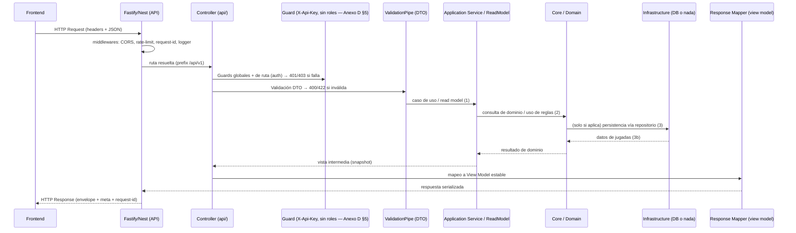
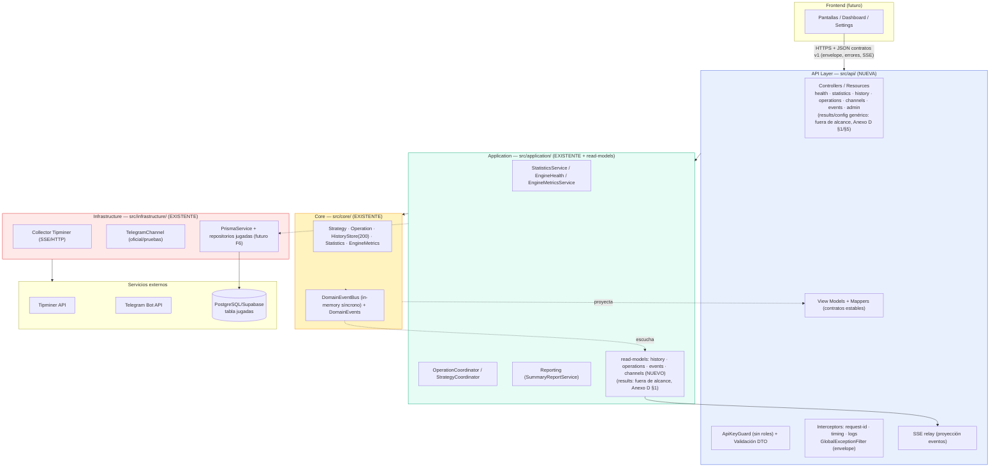
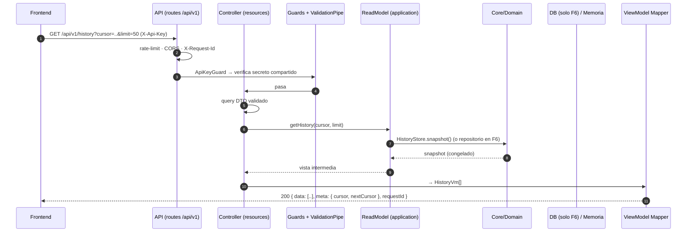
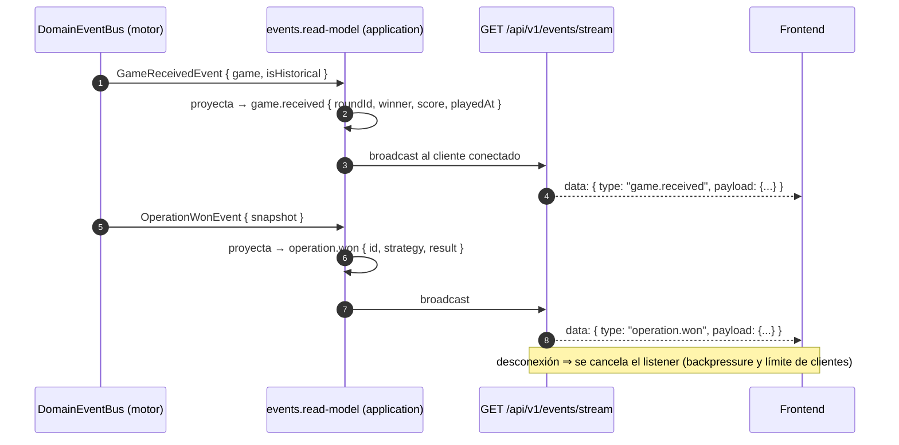

# Mk-Api.md — API Propia del Backend (Análisis Arquitectónico)

> **Estado:** borrador de arquitectura conceptual. No contiene código de implementación.
> **Nota metodológica:** a lo largo del documento se distinguen cuatro tipos de afirmaciones:
> - **Hecho** — verificado en el código actual del repo.
> - **Inferencia** — razonamiento sobre el código o el contexto, marcado como tal.
> - **Recomendación** — propuesta arquitectónica de este documento.
> - **Pendiente** — decisión que no puede resolverse con la información disponible y requiere auditoría de código o decisión de negocio.

---

# 1. Objetivo de la API

## 1.1 Qué problema resuelve

El backend actual carece de una **frontera de comunicación formal** con un frontend. Hoy la única exposición HTTP es `POST /admin/commands` (uso interno) y `GET /healthz` (healthcheck de plataforma) (**hecho** — verificado en `src/application/admin/admin.controller.ts` y `src/main.ts`). Todo lo demás vive dentro del motor: colección de jugadas, estrategias, operaciones, notificaciones, estadísticas, persistencia.

Cuando llegue un frontend, necesitará consumir información (resultados, estadísticas, estados, eventos, historial) y, más adelante, emitir órdenes (configuraciones, comandos administrativos). Sin una capa de API, ese frontend tendría que:

- conocer la estructura interna del motor y sus servicios,
- replicar lógica de transformación y seguridad,
- exponer al riesgo de red cosas que hoy están protegidas por diseño (estrategias, Telegram, config).

La API resuelve ese problema: es el **único punto de entrada controlado** del sistema hacia el exterior.

## 1.2 Por qué necesitamos una API propia

1. **Aislamiento del frontend** (Recomendación): el frontend debe consumir contratos estables y explícitos, no implementaciones.
2. **Seguridad de frontera**: autenticación, autorización, rate limiting, validación y control de errores concentrados en un solo lugar.
3. **Evolución sin tocar el núcleo**: los cambios en el núcleo (nuevas estrategias, canales, eventos) se reflejan en la API mediante *proyecciones* (view models), no obligando a reescribir el motor.
4. **Reutilización de la maquinaria existente**: `StatisticsService`, `EngineHealth`, `HistoryStore`, `OperationCoordinator` ya construyen snapshots de solo-lectura listos para exponer (verificado en `src/application/`; no existe un tipo `DistributionMetric` separado — ver corrección en §2.1b).
5. **Cero riesgo de tocar el flujo de eventos**: la API se construye como capa de consulta/comando por encima, sin introducirse en el ciclo `GameReceivedEvent → Strategy → Operation → Notification`.

## 1.3 Responsabilidad de la API

La API es una **capa de exposición, entrada, validación, transformación, autorización y coordinación**. Específicamente:

- exponer datos mediante `GET`,
- recibir datos y órdenes mediante `POST` (y `PUT`/`PATCH`/`DELETE` cuando corresponda),
- validar y transformar entradas del frontend en **casos de uso** que el sistema ya sabe resolver,
- devolver respuestas estructuradas y errores normalizados,
- autenticar y autorizar,
- proyectar el estado del motor (en memoria o persistido) a "vistas" estables,
- reenviar eventos del motor al frontend (streaming) sin exponer los eventos de dominio crudos.

## 1.4 Qué NO es su responsabilidad

- No es una segunda implementación del núcleo. No evalúa estrategias, no decide operaciones, no gestiona martingalas.
- No reimplementa lógica de negocio que ya existe en `core/`/`application/`.
- No habla directamente con integraciones externas (Tipminer, Telegram) ni con la base de datos. Solo a través de servicios/interfaces existentes (o nuevos casos de uso).
- No es un CRUD genérico: el sistema es fundamentalmente un *motor de eventos*; la API expone consultas y comandos sobre él.
- No almacena estado de sesión si se puede evitar (estado en tokens).

## 1.5 Relación con el frontend futuro

```
Frontend ──► solo conoce contratos de Mk-Api.md (env /api/v1/*)
              │
              ▼
Backend: API Layer ──► Application Core ──► Infra ──► DB / Tipminer / Telegram
```

El frontend desconoce: Tipminer, Telegram, Prisma/Supabase, `InMemoryHistoryStore`, estrategias, el `DomainEventBus`. Conoce únicamente: recursos, métodos HTTP, contratos de request/response, errores y eventos públicos.

## 1.6 Qué significa "desacoplada" en este proyecto

**No** significa otro proyecto, otro servidor, ni microservicios. Significa:

- **Lógica**: nueva capa `src/api/` con reglas de dependencia unidireccionales estrictas (ver §3 y §5), igual que ya se hace con `core/` → `application/` → `infrastructure/`.
- **Comunicación**: la API consume **servicios de caso de uso** de `application/` y contratos/interfaces de `core/`; nunca importa `infrastructure/` directamente.
- **Datos**: nunca expone entidades de Prisma ni payloads de Tipminer; siempre vista transformada.
- **Evolución**: el núcleo puede cambiar internamente sin romper contratos; la API puede crecer sin tocar el núcleo.

---

# 2. Estado actual y contexto del backend

## 2.1 Hechos verificados en el código

| Área | Hecho verificado |
|---|---|
| Stack | Node ≥22, NestJS 11, adaptador **Fastify**, puerto `3000` por defecto. |
| Patrón central | Motor de eventos: `GameEventCollector` (SSE Tipminer + historial HTTP) → `HistoryStore` (ring buffer 200, en memoria) → `GameReceivedEvent` → coordinadores (`Strategy`, `Operation`, `Notification`, `Statistics`, `EngineMetrics`, `Reporting`). |
| Bus de eventos | `InMemoryDomainEventBus` síncrono en memoria. Eventos existentes: `GameReceived`, `StrategyTriggered`, `OperationOpened`, `MartingaleOneReached`, `MartingaleTwoReached`, `OperationTieOccurred`, `OperationWon`, `OperationLost`, `NotificationSent`, `NotificationFailed`, `HourlyReportGenerated`. |
| Capas | `core/` (TS puro, cero `@nestjs/*`), `application/` (coordinadores/servicios, depende solo de `core`), `infrastructure/` (collector, Telegram, Prisma, config; depende de `core` y `application`). |
| HTTP actual | Solo `POST /admin/commands` (autenticación por `ADMIN_PASSWORD`, SHA-256 + `timingSafeEqual`) y `GET /healthz` (registrado a nivel de adapter en `main.ts`). |
| Persistencia | Prisma 6 + PostgreSQL/Supabase. Tabla `jugadas` (7 columnas: `id` BigInt PK, `uuid` único, `resultado`, `ganador`, `jugada_en`, `payload_original` JsonB, `insertado_en`; índices sobre `jugada_en` DESC y `(ganador, jugada_en)`). **Nadie la escribe ni la lee todavía**: `PrismaService` existe pero ningún consumidor lo inyecta; si `DATABASE_URL` falta, la app funciona sin persistencia. |
| Dependencias HTTP/validation | **No hay** `class-validator`, `class-transformer`, `@nestjs/jwt`, `@nestjs/throttler`, plugin CORS/rate-limit explícito. La validación actual es manual (ver `AdminController`). |
| Notificaciones | Telegram con dos canales (oficial y pruebas), fire-and-forget, retries y cleanup de mensajes intermedios (4 s). |
| Estado | Corre solo en local; sin Docker/VPS. CI: lint → test → build en cada push a `main`. |
| Pruebas | Jest unitario (`*.spec.ts`) y `src/e2e/full-pipeline.e2e.spec.ts` (pipeline completo sin Tipminer/Telegram reales). |
| Healthcheck | `EngineHealth` (clase de consulta pura, no participa del flujo) con snapshot: `collectorConnected`, `lastGameReceivedAt`, `gamesInMemory`, `activeOperations`, `registeredStrategies`, `registeredChannels`, `lastError`. |

## 2.1b Correcciones fácticas (auditoría de código, 2026-08-10)

Verificación puntual contra el código real. El resto del documento asumía algunos campos/mecanismos que **no existen todal como están descritos**. Se deja constancia aquí en vez de reescribir cada mención dispersa:

| Afirmación original en este documento | Realidad verificada en código |
|---|---|
| `EngineHealthSnapshot` incluye `ok` y `db` (Anexo A, §18.1) | **Hecho corregido**: `EngineHealthSnapshot` (`src/core/observability/types/engine-health-snapshot.type.ts`) solo tiene `collectorConnected`, `lastGameReceivedAt`, `gamesInMemory`, `activeOperations`, `registeredStrategies`, `registeredChannels`, `lastError`. `ok` se sintetiza a mano en `main.ts` al armar la respuesta de `/healthz`; `db` **no existe en ningún lado hoy** — es una propuesta de este documento para el futuro `GET /api/v1/health`, no un campo ya presente. |
| `StatisticsService`/`DistributionMetric` expone `playerPct`, `tiePct`, `bankerPct` (Anexo A) | **Hecho corregido**: no existe un tipo `DistributionMetric`. `Statistics` (`src/core/statistics/statistics.entity.ts`) expone `totalGames`, `playerWins`, `bankerWins`, `ties`, `playerWinRate`, `bankerWinRate`, `tieRate`, `currentStreak: { winner, length }`. Sí es O(1) (`recordGame` solo incrementa contadores). |
| `OperationSnapshot` — "auditar campos" (Anexo A/B) | **Resuelto**: `operationId`, `strategyId`, `recommendedWinner`, `streakWinner`, `currentState`, `currentMartingale`, `maxMartingales`, `openedAt`, `closedAt`, `reason`, `history`. Estados posibles: `OPEN`, `MG1`, `MG2`, `WON`, `LOST`, `CANCELLED`. `CANCELLED` existe en el enum pero **nada lo produce hoy** — ver pregunta nueva en Anexo B. No hay estado `TIE` (el TIE es un evento aparte, `OperationTieOccurredEvent`, que no cierra la operación). |
| "Múltiples operaciones activas simultáneas" sin precisar límite | **Precisado**: `ActiveOperationRegistry.canExecute(strategyId)` bloquea una segunda operación **para la misma estrategia**, pero como hoy conviven dos estrategias (`Streak4Strategy` oficial + `Alternancia34Strategy` pruebas), **pueden existir hasta 2 operaciones activas simultáneas en todo el sistema**, una por estrategia. |
| `PrismaService.checkHealth()` como base del `db` en salud | El método **sí existe** (`prisma.service.ts`, devuelve `{ok, latencyMs?, error?}`) pero **hoy no está conectado a `EngineHealth` ni a `/healthz`** — es un cable suelto, no una integración hecha. |
| Alcance de `AdminController`/`POST /admin/commands` | Hoy soporta **un único comando**: `RESUMEN`. Cualquier otro valor devuelve 400. La migración de ADR-11/F7 es más pequeña de lo que el documento da a entender — no hay una superficie amplia de comandos que migrar todavía. |
| CORS / prefijo global | Confirmado que **no existen** `setGlobalPrefix` ni `enableCors` en `main.ts` hoy (coherente con que el documento los trata como propuesta a implementar en F1-F2, no como hecho existente). |
| Habilitar/deshabilitar estrategias en runtime (§7.1.6) | `Strategy.enabled()` está **hardcodeado en el core** (booleano fijo en código, no leído de config ni de estado mutable). Exponer un `POST`/`PATCH` que active/desactive una estrategia **requiere tocar `core/`**, no es solo trabajo de capa API — esto cambia el análisis de esfuerzo de esa pieza pendiente. |

## 2.2 Responsabilidades actuales

1. **Ingesta en vivo**: SSE de Tipminer, reconexión, deduplicación.
2. **Historial en memoria**: ring buffer (200 juegos) + snapshot congelado para estrategias.
3. **Detección de patrones**: `Streak4Strategy` (oficial), `Alternancia34Strategy` (pruebas, score de confianza), salvaguardas anti-señales-duplicadas.
4. **Simulación de operaciones**: martingala MG1/MG2, TIE, estados WON/LOST.
5. **Notificaciones Telegram + resúmenes periódicos** (`ReportScheduler`, comando admin RESUMEN).
6. **Estadísticas y métricas** incrementales O(1) (`Statistics`, `EngineMetrics`).
7. **Persistencia opcional** (preparada, no usada).

## 2.3 Puntos de acoplamiento y riesgos identificados (Inferencia)

| Riesgo | Descripción |
|---|---|
| In-memory como fuente primaria de datos consultables | `HistoryStore` (200 partidas) y contadores viven en el proceso. El frontend tendrá ventanas de datos limitadas si solo se expone lo que está en memoria. |
| Persistencia no conectada | `jugadas` es "fuente de verdad para el futuro" según `schema.prisma`, pero nada ingresa datos. Una API de *resultados históricos profundos* depende de conectar la ingesta a DB (**Pendiente**: decisión de negocio si la API expondrá historial total o solo la ventana en memoria). |
| Único proceso/única instancia | `HistoryStore`, el bus y el SSE son por-proceso. Multiplicar instancias sin plan desincroniza el estado (**Pendiente/riesgo de escala**, ver §16). |
| `AdminController` fuera de toda convención HTTP | Sin envelope, sin errores normalizados, validación manual. Debe migrarse o convivir con la nueva API (ver §5 y §20). |
| Sin capa de auth | Solo una contraseña compartida. No hay usuarios, roles, tokens, expiración de sesión. |
| Sin validación declarativa | Aumenta conforme crezcan los endpoints. |
| `setTimeout`/`setInterval` en el motor | Report scheduler usa timers; conviene saber qué timers existen antes de exponer "estados" (auditar: `report-scheduler.ts`, cleanup de Telegram). |
| Sin correlation/trazabilidad HTTP | No hay request-id ni logs estructurados por petición. |

**Nota:** cualquier afirmación sobre el funcionamiento interno de estrategias, operaciones o notificaciones está documentada en `ARCHITECTURE.md`/`README.md`, pero el **detalle fino** (p. ej. qué campos exactos tiene cada snapshot, si `OperationSnapshot` es proyectable sin más) requiere auditoría puntual (§20, Fase 0).

## 2.4 Si conectáramos el frontend directo al núcleo (por qué NO)

- se acoplaría a tipos internos sin estabilidad contractual,
- reexpone tokens de integración (si el frontend tocara Tipminer/Telegram),
- cada cambio en `core/` rompería el frontend,
- sin auth ni rate limiting, el proceso quedaría expuesto a abuso,
- se duplicaría lógica de mapeo en cada pantalla.

---

# 3. Arquitectura propuesta

## 3.1 Estructura conceptual

La separación propuesta por el enunciado es **adecuada** para este proyecto, con un ajuste: la nueva capa es una **capa de presentación (API)** por encima de `infrastructure/`, no una capa intermedia.

```
Frontend
   │  HTTPS + contratos HTTP (JSON)
   ▼
──────────────────────────────────────────────────────
  API Layer (src/api/)          ← NUEVA
  Controllers, DTOs, Guards, Filters, Interceptors,
  View Models / Mappers, SSE event relay
──────────────────────────────────────────────────────
   │  casos de uso / servicios de aplicación
   ▼
──────────────────────────────────────────────────────
  Application (src/application/)     ← EXISTENTE
  Coordinadores y servicios de caso de uso:
  StatisticsService, EngineHealth, OperationCoordinator,
  Reporting, + nuevos "read models" y "command services"
──────────────────────────────────────────────────────
   │  interfaces y operaciones de dominio
   ▼
──────────────────────────────────────────────────────
  Core (src/core/)                   ← EXISTENTE
  TS puro. Strategy, Operation, HistoryStore,
  Statistics, EngineMetrics, DomainEvents
──────────────────────────────────────────────────────
   │  implementaciones de integraciones
   ▼
──────────────────────────────────────────────────────
  Infrastructure (src/infrastructure/)  ← EXISTENTE
  Tipminer (collector), Telegram, Prisma (jugadas), Config
──────────────────────────────────────────────────────
   │
   ▼
  PostgreSQL/Supabase  ·  Tipminer API  ·  Telegram Bot API
```

**¿Por qué API por encima de infrastructure y no entre core y application?** Porque la API consume *resultados de casos de uso* (servicios de aplicación) y define contratos públicos. Si fuera una capa intermedia, tendría que depender de todo y todo dependería de ella — al revés de lo que queremos. La regla clave queda:

> **`api/` depende de `core/` y `application/`. Nunca de `infrastructure/`.**
> **`infrastructure/` no conoce `api/`.** (Nada conoce `api/` salvo `AppModule`.)

Esto replica el patrón de dependencia unidireccional ya verificado con grep en el repo (§3 de `ARCHITECTURE.md`) y lo extiende verticalmente.

## 3.2 Responsabilidades por capa

| Capa | Responsabilidad | NO hace |
|---|---|---|
| **API** | Recibir HTTP, autenticar, autorizar, validar, transformar (DTO → use case, entidad → view model), serializar, mapear errores, aplicar políticas (rate limit, CORS, paginación), reenviar eventos vía SSE. | No conoce Tipminer/Telegram/Prisma. No decide negocio. No ejecuta consultas directas a DB. No guarda estado de sesión (salvo contados casos). |
| **Application** | Orquestar casos de uso, leer/proyectar el estado del motor, traducir órdenes de la API en llamadas a `core`, publicar eventos de dominio cuando corresponda. | No implementa infraestructura. |
| **Core** | Reglas de negocio puras, entidades, máquinas de estado, estrategias, eventos de dominio. | No sabe que existe HTTP. |
| **Infrastructure** | Implementa integraciones y persistencia: colección Tipminer, Telegram, Prisma, config de entorno. | No expone su existencia hacia arriba (solo a través de interfaces). |

## 3.3 ¿Alternativa mejor que la propuesta del enunciado?

La propuesta del enunciado es correcta en lo esencial. El ajuste importante es **no añadir una capa formal de "Use Cases" como nuevo directorio**: los casos de uso deben vivir en `application/` (donde ya está la orquestación, p. ej. `StrategyCoordinator`). La API no necesita su propia capa de aplicación: necesita **servicios de aplicación que ya existen** (Recomendación, motivada por la regla "no duplicar lógica").

Dónde sí añadiremos piezas nuevas:

- `api/` — la capa de presentación completa (nueva).
- `application/read-models/` (Recomendación) — servicios finos que proyectan el estado del motor en forma de "vistas" listas para exponer (historial, resultados de la ventana en memoria, operaciones, distribuciones). Estas vistas son *lógica nueva*, no duplicación, y por eso viven en `application`, no en `api`.
- Posibles *repositories abstractos* (interfaces) en `core/` o `application/` para acceso a `jugadas` (Pendiente, ver §10).

---

# 4. Nivel real de desacoplamiento

## 4.1 Alternativas y análisis

| Nivel | Ventajas | Desventajas | Rendimiento | Complejidad | Cuándo usarlo | Cuándo NO |
|---|---|---|---|---|---|---|
| **A. Mismo módulo/proyecto, dependencias directas** | Simple; cero infra nueva; comparte test suite | Acopla; difícil aislar cambios; riesgo de que controllers toquen infra | Mejor (sin saltos I/O extra) | Mínima | Prototipos, POCs | No lo recomendamos como destino final para una API pública |
| **B. Módulos NestJS con dependencias gobernadas (Recomendado)** | Separación real por módulos + reglas verificables; DI de Nest maneja wiring; mismo proceso; costo nulo de red | Un proceso (un fallo de memoria/event loop derriba API y motor); requiere disciplina en imports | Excelente; mismo proceso, cero overhead de red | Media | **Nuestro caso hoy** | Cuando haya dominios con ciclos de vida de despliegue independientes |
| **C. Interfaces/servicios con inversión de dependencia** | El consumidor depende del contrato, no de la impl; tests unitarios triviales | Más archivos/indirección; riesgo de sobre-ingeniería | Igual que B (zero-cost) | Media-baja | **Siempre**, dentro del desacoplamiento lógico (patrón ya usado: `HISTORY_STORE`, `STRATEGIES`, `NOTIFICATION_CHANNELS` tokens) | Cuando el contrato y la implementación son la misma cosa y no cambiarán |
| **D. Eventos (event-driven interno)** | El motor ya es 100% event-driven; la API puede *consumir* eventos para SSE sin conocer emisores | Eventos síncronos en memoria no aíslan fallos; sin cola no hay persistencia/reintento | Excelente en-proceso | Baja (bus ya existe) | Para flujo de datos en vivo hacia el frontend (ver §13) | No para exponer lectura directa (un GET no debería depender de un evento) |
| **E. Colas (RabbitMQ/SQS/BullMQ)** | Persistencia del mensaje, reintentos, backpressure, workers separados | Infra nueva, latencia, complejidad operativa, debugging más difícil | Overhead de serialización/red | Alta | Cuando haya jobs pesados, acoplados a dependencias lentas o picos de volumen | **Hoy NO** — el `DomainEventBus` en memoria cubre el caso; introducir cola ahora es sobrearquitectura |
| **F. Procesos separados (API en distinto servidor/contenedor)** | Aislamiento de fallos y escalado independiente | Costo operativo (despliegue, config, red), y **la fuente de verdad en memoria del motor rompe el aislamiento** (la API no podría leer el estado del motor sin compartirlo) | Penalización de red por request | Media-alta | Cuando el motor sea demasiado pesado para el proceso de API o el VPS exija separación | Hoy: no hay VPS, el motor es la mitad de la app; separar procesos ahora no da beneficio real |
| **G. Microservicios** | Aislamiento total, escalado fino, equipos independientes | Todo lo anterior + operación distribuida, consistencia, observabilidad compleja | Peor (latencia red, serialización, joins entre servicios) | Máxima | Nunca para una app de 1-3 usuarios operando un motor de análisis en tiempo real | **Nunca en esta etapa** — sería microservicios por estética, no por necesidad |

## 4.2 Estrategia recomendada

> **B + C, con evolución escalonada hacia F:** API dentro del mismo proceso NestJS, en su propia capa `src/api/`, consumiendo `application/` y `core/` mediante **interfaces y servicios** (C). La arquitectura debe permitir que mañana `api/` (o un subconjunto de read-models) se separe a proceso propio **sin reconstruir** el sistema — ver §16.

**Justificación:** apilada sobre un motor event-driven en memoria, una API por-proceso ofrece el mejor rendimiento (cero red), la menor complejidad y la máxima mantenibilidad. Los niveles E/F/G añaden coste sin resolver ninguna restricción real actual; los necesitaremos —si acaso— cuando existan múltiples instancias o jobs pesados (§16). La regla de oro: **desacoplar por contratos ahora, por procesos solo cuando la evidencia lo pida.**

---

# 5. Estructura modular propuesta para NestJS

## 5.1 Principios de diseño

1. Los módulos de la API son **finitos y finos**: un módulo por recurso expuesto (no uno por entidad).
2. Ningún módulo de `api/` importa módulos de `infrastructure/`.
3. La única excepción de wiring global es `AppModule` (composition root, como hoy).
4. Los servicios de `application/` que ya existen **no se tocan** salvo para añadir métodos de lectura explícitos, nunca para cambiar su lógica.
5. El orden de `imports` de NestJS no debe importar para la corrección (lección ya documentada en el repo).

## 5.2 Estructura conceptual

```
src/
├── core/                          (EXISTENTE — sin cambios salvo tipos nuevos)
│   └── …
├── application/                   (EXISTENTE)
│   ├── statistics/                (EXISTENTE)
│   ├── observability/             (EXISTENTE — EngineHealth, EngineMetricsService)
│   ├── operation/                 (EXISTENTE)
│   ├── reporting/                 (EXISTENTE)
│   ├── history/                   (EXISTENTE)
│   └── read-models/               (NUEVO — ver nota)
│       ├── history.read-model.ts          ventana en memoria + proyección paginable
│       ├── results.read-model.ts          jugadas desde DB (Pendiente Fase 6)
│       └── events.read-model.ts           relay de dominio → vista pública
├── infrastructure/                (EXISTENTE)
│   ├── collector/  telegram/  persistence/  config/
│   └── persistence/
│       └── repositories/          (NUEVO — opcional Fase 6: repos concretos de juegos)
├── api/                           (NUEVO — capa de presentación)
│   ├── api.module.ts              agrupa recursos + common
│   ├── common/
│   │   ├── filters/               global-exception.filter (mapeo error → envelope)
│   │   ├── interceptors/          request-id, timing, envelope
│   │   ├── pipes/                 validación global, paginación, parse-uuid
│   │   ├── guards/                api-key.guard (secreto compartido, ver Anexo D §5 — no hay roles)
│   │   ├── decorators/            @Public (health)
│   │   └── pagination/            contrato de paginación (cursor/offset)
│   ├── auth/                      **retirado**: no hay login/JWT (Anexo D §5); el guard vive en `common/guards/api-key.guard`
│   ├── contracts/                 view models + mappers + códigos de error
│   │   ├── view-models/           statistics.vm.ts, history.vm.ts, …
│   │   └── mappers/               domainToStatisticsVm, domainToHistoryVm, …
│   ├── resources/
│   │   ├── health/                GET /api/v1/health [+ liveness/readiness, incl. `db` desde F2 — Anexo D §7]
│   │   ├── statistics/            GET /api/v1/statistics
│   │   ├── history/               GET /api/v1/history (única fuente de historial por ahora — Anexo D §1; sirve también como snapshot inicial, ver D.8)
│   │   ├── results/               **fuera de alcance actual** (Anexo D §1) — se retoma solo si se decide activar `jugadas`
│   │   ├── operations/            GET /api/v1/operations?channel=oficial|pruebas (Anexo D §2) + POST /operations/:id/cancel (Anexo D §4)
│   │   ├── channels/              PATCH asignación estrategia↔canal + toggle de alertas por canal + parámetros de martingala (Anexo D §3, §5)
│   │   ├── events/                GET /api/v1/events/stream (SSE): eventos de operación + `game.received`/`stats.rolling` (Anexo D §9)
│   │   └── admin/                 migra AdminController (por ahora solo comando `RESUMEN` — Anexo D §7)
│   └── …
├── app.module.ts                  (composition root — importa ApiModule)
└── main.ts                        (configura prefix, CORS, rate-limit, healthz)
```

**Nota sobre `application/read-models/`:** los read models son servicios que *proyectan* estado del motor con forma de vista pública (paginación, mapeo a tipos estables). No duplican negocio: solo aíslan la forma de lectura. Esta decisión respeta "la API no ejecuta consultas": el controller pide a un servicio de aplicación, y ese servicio lee fuentes (`HistoryStore`, `PrismaService`, `EngineHealth`).

## 5.3 Matriz de dependencias entre módulos propuestas

| Módulo | Depende de | Comunicación | ¿Accesible desde API directo? |
|---|---|---|---|
| `api/*` | `application/*`, `core/*` (interfaces) | Inyección DI + llamadas directas | — (es la API) |
| `ReadModels` | `core/interfaces/*`, `application` | DI | Controllers de `api` consumen read models y servicios existentes |
| `Statistics` (cierra Service) | `core/statistics` | El controller usa `StatisticsService.getSnapshot()` | Sí, solo vía método de caso de uso |
| `OperationCoordinator` | `core/operation` | El controller **no** debe inyectarlo directamente; usa un read model de operaciones (decisiones pendientes de auditoría del snapshot) | No directo — vía `read-models/operations.read-model` |
| `EngineHealth` | core+infra internos | Salud expuesta por controller `health` | Sí (es consulta pura por diseño, ya documentado) |
| `ApiKeyGuard` (`api/common/guards`) | `ConfigService` (secreto compartido, ver Anexo D §5) | Guard global | Interno de la API — no hay módulo `auth` con login |
| `Persistence` | Prisma | Solo `application`/`infrastructure` con repositorios; nunca `api` | **No** |
| `Collector`/`Telegram` | — | Nunca importado por `api` | **No** |

**Protección estricta:** `api/` tiene prohibido importar `collector`, `telegram`, y tocar el cliente Prisma. Verificación en CI propuesta: una regla de eslint o script de grep (como el que ya usa el repo para verificar capas) — (Recomendación, ver §20).

---

# 6. Flujo de una petición

## 6.1 Flujo conceptual



## 6.2 Qué ocurre en cada etapa

| Etapa | Responsabilidad | Quién lo hace |
|---|---|---|
| **HTTP Request** | parsear método/ruta/query/headers/body | Fastify |
| **Middleware de entrada** | CORS, rate limiting, asignación de `X-Request-Id` (correlation), logs de entrada | Fastify plugins + interceptor |
| **Authentication** | verificar `X-Api-Key` contra el secreto compartido (hash + `timingSafeEqual`, igual patrón que `ADMIN_PASSWORD` hoy — Anexo D §5) | `ApiKeyGuard` global |
| **Authorization** | no aplica: un solo cliente de confianza (el frontend propio), sin roles (Anexo D §5) | — |
| **Validation** | DTO con reglas estrictas; `whitelist` (rechazar campos desconocidos) | `ValidationPipe` global |
| **DTO → Use Case** | transformar entradas del contrato al *lenguaje del dominio* | controller → servicio de aplicación |
| **Use Case / ReadModel** | orquestar lectura/pipes; aplicar reglas; no exponer implementación | `application/services` |
| **Domain / Core** | reglas de negocio puras; máquinas de estado; snapshot congelados | `core/` |
| **Infrastructure** | única capa que toca DB/APIs externas | repositorios concretos (`application` los pide vía interfaz) |
| **Response Mapping** | entidad/snapshot → **view model público** (nombres estables, sin campos internos) | `api/contracts/mappers` |
| **HTTP Response** | envelope `{ data, meta }` o `{ error }` + headers + request-id | interceptor/filtro |

## 6.3 Dónde vive cada preocupación transversal

| Preocupación | Dónde se maneja | Justificación |
|---|---|---|
| Validación | `ValidationPipe` (rutas) + reglas en DTO | central, declarativa, evita validar en controllers |
| Errores | `GlobalExceptionFilter` (mapea excepciones `Nest` y de `core` → envelope HTTP) | un solo formato de error, sin stack traces |
| Logs | Interceptor de entrada/salida + middleware request-id | cada request tiene trace |
| Métricas | Interceptor de timing (duración por endpoint) | barato, sin dependencias nuevas |
| Autenticación | `ApiKeyGuard` (secreto compartido, sin roles — Anexo D §5) | nunca en el controller |
| Transformación | DTOs de entrada + mappers de salida | ninguno en el controller |
| Caching | Respuestas idempotentes de lectura; decisiones en §15 | evitar en caliente; reconsiderar con DB |
| Rate limiting | Plugin de Fastify (nivel adapter) + reglas por endpoint | costo mínimo, protección global |
| Auditoría | Interceptor para escrituras + log estructurado de comandos | comandos admin deben quedar registrados |

---

# 7. GET, POST, PUT, PATCH y DELETE

## 7.1 Principios de decisión (no lista final de endpoints)

1. **Recursos públicos** (Recomendación): solo `GET /api/v1/health*`. Todo lo demás autenticado.
2. **Lectura = GET siempre**: nunca GET con efectos secundarios. Nunca datos sensibles por query (uso de headers de auth).
3. **Modificación de estado**:
   - *Crear/ejecutar acción* → **POST** (aunque sea idempotente por efecto, por claridad semántica), con opción de header `Idempotency-Key` para comandos reintentables (ver §19).
   - *Reemplazo completo* de un recurso → **PUT** (idempotente, el cliente envía el estado íntegro). Ej.: reemplazo total de una configuración.
   - *Actualización parcial* → **PATCH** (campos opcionales, `null` = borrar dato). Preferir PATCH sobre PUT para config al ser un recurso con muchos campos.
   - *Eliminación* → **DELETE**; solo cuando el dominio lo soporte real (hoy casi nada es borrable; probablemente quede para datos administrativos, Pendiente Fase 6).
4. **Idempotencia**: GET, PUT, DELETE son idempotentes por definición; POST con `Idempotency-Key` cuando el cliente pueda reintentar y la repetición no deba duplicar efecto (p. ej. "generar resumen" no duplica, "crear alerta" sí podría).
5. **Evitar exponer directamente**: acciones de baja frecuencia y efecto interno (limpiar caché, reiniciar collector, disparar reportes) se exponen como *comandos POST* explícitos (`POST /api/v1/admin/…`), jamás como rutas genéricas.
6. **Operaciones que modifican el motor** (asignar estrategia↔canal, alertas por canal, martingala, cancelar operación) → comandos versionados bajo `channels`/`operations`/`admin`, con auditoría. **Alcance confirmado por el dueño del sistema (Anexo D §3, §4, §5)**; queda pendiente solo el detalle técnico de aplicación (mutar estado en memoria del proceso vía nuevos casos de uso en `application/`, no variables de entorno — se resuelve en Fase 0 auditando `core/operation`, `StrategyRuntimeState` y el punto de enable/disable de `Strategy`).
7. **Nunca REST por estética**: si un recurso no existe en el dominio (p. ej. "usuarios"), no se crea un CRUD vacío.

## 7.2 Tabla de referencia rápida

| Método | Semántica | Idempotente | Uso típico aquí |
|---|---|---|---|
| `GET` | leer sin efectos | sí | statistics, history, results, health, events (SSE) |
| `POST` | crear o ejecutar comando | no (salvo Key) | admin commands, config reemplazo completo |
| `PUT` | reemplazo total | sí | config completa |
| `PATCH` | actualización parcial | no | config parcial |
| `DELETE` | borrado | sí | pendiente determinar; probablemente ninguno en corto plazo |

---

# 8. Contratos API

## 8.1 Reglas conceptuales de los contratos

- Los contratos se definen **en el backend** (`api/contracts/`) y se versionan con la API; el frontend solo los consume.
- **Un contrato por recurso**, con tipos TS exportados (TypeScript types/interfaces, no clases de runtime salvo los DTOs de entrada).
- Nombres de campo en inglés estable (el dominio usa `winner`, `playedAt`, `gamesInMemory` — consistencia con el código actual, ver `EngineHealthSnapshot`).
- Todos los IDs: strings (uuid) o strings de números BigInt (id de jugada) — **nunca números que pierdan precisión** (el BigInt de la PK de jugadas NO cabe en `number` JS; debe serializarse como string).
- Fechas: ISO-8601 UTC con zona (`2026-08-10T12:34:56.789Z`). El motor ya trabaja en UTC (`jugadaEn`/`playedAt`).
- Timestamps: mismo formato; el frontend transforma a local.

## 8.2 Estructura de request

```
GET  /api/v1/history?cursor=…&limit=50
X-Api-Key: <secreto compartido>   ← no es Bearer/JWT, ver Anexo D §5
```

- Query params: solo los definidos por contrato (paginación, filtros whitelist).
- Body (POST/PUT/PATCH): JSON con DTO validado (`whitelist: true` → rechaza campos desconocidos con 400/422).
- Headers: `X-Api-Key` (secreto compartido, Anexo D §5 — no `Authorization: Bearer`), `X-Request-Id` (opcional de entrada; se respeta si viene), `Idempotency-Key` (comandos).

## 8.3 Estructura de response

Envelope único (Recomendación):

```jsonc
// Éxito (lectura/consulta)
{
  "data": { …view model… },            // o array
  "meta": {                             // opcional: paginación / metadata
    "cursor": "…", "nextCursor": "…", "limit": 50, "total": 1234
  },
  "requestId": "req_ab12…"
}

// Éxito con creación  → 201 + Location
// Éxito sin contenido  → 204 sin body
// Error
{
  "error": {
    "code": "VALIDATION_ERROR",          // código máquina estable
    "message": "Reglas de validación violadas",     // humano, i18n futura
    "details": [ { "field": "state", "reason": "enum" } ],  // opcional
    "requestId": "req_ab12…",
    "timestamp": "2026-08-10T12:34:56.789Z"
  }
}
```

Reglas:

- El array de datos de paginación vive en `data` (siempre array, nunca null → `data: []`).
- `meta` solo si hay paginación/metadata útil.
- `requestId` obligatorio en éxito y error (trazabilidad).
- Códigos HTTP por estado; nunca HTTP 200 con error embebido.

## 8.4 Paginación, filtros y ordenamiento

- **Cursor-based** (Recomendación) para listas append-only (historial de jugadas): el cursor es el `id` (BigInt) o la fecha de la última fila vista; la clave única de orden es el índice existente `jugadaEn DESC`. Ventajas: estable bajo escritura concurrente, O(log n), evita saltos.
- **Offset+limit** para listas pequeñas y administrativas (config, canales): `page`/`perPage`.
- Defaults: `limit=50`, `max=100` (cortado silenciosamente, no con error).
- Filtros: por contrato explícito y whitelist (ej. `winner`, rango `from`/`to`) — nunca filtros libres tipo "cualquier columna".
- Ordenamiento: campos whitelist con `sort=jugadaEn:desc`; nada más.

## 8.5 Códigos HTTP y errores

| Código | Situación | Ejemplo |
|---|---|---|
| 200 | éxito lectura/consulta | GET statistics |
| 201 | recurso creado | POST jobs (futuro) |
| 202 | trabajo aceptado (async) | comando largo (Fase futura) |
| 204 | éxito sin cuerpo | DELETE |
| 400 | request malformado / contrato violado | body inválido sintaxis, query desconocida |
| 401 | no autenticado | falta `X-Api-Key` o no coincide (Anexo D §5 — no hay expiración de token, es un secreto estático) |
| 403 | (no aplica hoy: sin roles, ver Anexo D §5) | reservado para si algún día existiera un permiso diferenciado |
| 404 | recurso inexistente | cursor inválido, id no existe |
| 409 | conflicto de estado | operación ya cerrada, idempotency duplicada |
| 422 | semántica de negocio inválida | winner inválido, rango de fechas invertido |
| 429 | rate limit excedido | + header `Retry-After` |
| 500 | error no esperado (ya logueado) | nunca detalle interno |
| 503 | dependencia no disponible | DB caída, collector desconectado (degradado explícito) |

Códigos de error máquina (`code`) estables alfanuméricos de la familia: `NOT_FOUND`, `VALIDATION_ERROR`, `UNAUTHORIZED`, `FORBIDDEN`, `CONFLICT`, `RATE_LIMITED`, `INTERNAL`, `UNAVAILABLE`, `DEPENDENCY_DOWN`. Un mapeo central (tabla) en `api/common/errors` para no dispersar strings.

## 8.6 Versionado (ver §17) e identificadores

- Ruta base fija `api/v1`; todas las reglas de contrato viven dentro de esa versión.
- Identificadores de jugada: string (serialización) mientras el tipo subyacente sea BigInt.

---

# 9. Separación entre entidades internas y respuestas API

## 9.1 El problema

El riesgo real: si la API devuelve `Prisma.Jugada`, `OperationSnapshot` o el `Game` crudo, el frontend queda atado a: nombres de columnas de Supabase, campos internos (`payloadOriginal` crudo de Tipminer, `insertadoEn`), campos de máquina de estados (p. ej. `transition`), y cualquier campo futuro del esquema. **Cualquier cambio interno rompe el frontend — justo lo que la API debe evitar.**

## 9.2 Mecanismos

| Mecanismo | Rol | Recomendación aquí |
|---|---|---|
| **DTOs** (entrada) | definir y validar qué recibe el backend | obligatorio (`ValidationPipe`) |
| **View Models** (salida) | definir qué ve el frontend: tipos TS explícitos, estructurados, sin campos internos | obligatorio |
| **Mappers** | transformar snapshot/entidad → view model | obligatorio (patrón ya usado: `game.mapper.ts` (hecho) — mismo estilo, funciones puras explícitas) |
| **Serializers** (class-transformer) | transformar automáticamente clases | **No recomendado** (Recomendación): añade magia y coste de runtime; el repo ya tiene estilo "mapper manual" |
| **Response models** | tipos que viajan al wire | igual que view models (misma cosa) |

División de *formas*: **entidad interna** (`Game`, `Jugada`, `Operation`) → **view model público** (`GameVm`, `ResultVm`, `StatisticsVm`, `OperationVm`, `HealthVm`). Los view models viven en `api/contracts/` y **no** en `core/` (son contrato de presentación, no dominio).

```jsonc
// Interno (nunca enviado): Prisma.Jugada { id: BigInt(42n), uuid, resultado, ganador, payloadOriginal: {…Tipminer…}, insertadoEn }
// Público GET /api/v1/results:
{
  "data": [
    { "id": "42", "roundId": "uuid-tipminer", "winner": "PLAYER", "score": 8, "playedAt": "2026-08-10T12:33:01.000Z" }
  ],
  "meta": { "cursor": "57", "nextCursor": "58", "limit": 50 }
}
```

## 9.3 Beneficios

- **Seguridad**: `payloadOriginal` (payload crudo externo) y `insertadoEn` (operativo) nunca salen; el frontend no puede inferir esquema interno.
- **Evolución**: cambiar `jugadas` (añadir columna, renombrar) = tocar el mapper, no a los consumidores.
- **Desacoplamiento**: el contrato es fuente de verdad para el frontend.
- **Rendimiento**: mappers manuales son más rápidos que serializers reflectivos (no crítico hoy, pero gratis).
- **Mantenibilidad**: un mapper por recurso, probado con unit tests; cero sorpresas.

---

# 10. API y base de datos

## 10.1 Alternativas

| Ruta | Características | Veredicto |
|---|---|---|
| **Controller → Prisma** (directo) | rápido de escribir | ❌ prohibido: expone esquema, duplica lógica, rompe capas |
| **Controller → repositorio → DB** | bien para CRUD, pero el repositorio a secas no conoce reglas de negocio (estrategias, estados) | ⚠️ parcial: sirve para consultas finas de resultados, no para dominio |
| **Controller → servicio de aplicación (caso de uso) → repositorio → DB** | el servicio aplica reglas y orquesta; el repositorio solo lee/escribe | ✅ **Recomendado** |
| **Controller → lógica de negocio (core) → repositorio → DB** | igual que el anterior visto desde core: core decide, aplicación orquesta, infra lee | ✅ idéntico al anterior — es el mismo patrón |

## 10.2 Recomendación para este proyecto

> Ruta completa: `API → Application Service (caso de uso / read model) → (opcional) core → Repositorio (interfaz) → Prisma / Source`. Los controllers **nunca** ejecutan consultas ni contienen lógica de negocio.

- Para datos en memoria: `HistoryStore` (interfaz de core) y `Statistics` ya son la "fuente"; un read model de `application/` los expone con paginación de ventana (pendiente: decidir cómo paginar un ring buffer de 200; probablemente full array + slice desde el read model).
- Para `jugadas` (DB, Fase 6): definir **interfaz repositorio** (p. ej. `GamesRepository` con `findPage(cursor, limit, filters)`) en `application/` (o `core/interfaces/`), e implementación con Prisma en `infrastructure/persistence/repositories/`. Hoy esa interfaz no existe porque nadie lee la DB (**hecho**).
- **Pendiente (requiere auditoría)**: decidir la fuente primaria del historial expuesto (memoria vs DB) y si la ingesta a `jugadas` se activa (el esquema ya está listo). La API debería definir su contrato *de entrada* en Fase 3 (ventana en memoria) y enchufar la DB en Fase 6 sin romper el contrato.

## 10.3 Reglas anti-duplicación

- Leer distribuciones/estadísticas → `StatisticsService` (existente; campos reales `playerWinRate`/`bankerWinRate`/`tieRate`/`currentStreak`, ver §2.1b). No recalcular en el controller.
- Leer estado del motor → `EngineHealth.getSnapshot()` (existente).
- Leer operaciones activas → read model sobre `OperationCoordinator` (auditar snapshot).
- Consultas nuevas a `jugadas` → caso de uso en `application`, jamás en `api`.

---

# 11. Integraciones externas

## 11.1 Hecho actual

Tipminer y Telegram son consumidos **solo** por `infrastructure/` (`collector/`, `telegram/`), detrás de clases (nunca de forma directa desde `core/`). El patrón de "adaptador" ya está establecido en el repo (interfaces `NotificationChannel`, `SseClient`, tokens DI).

## 11.2 Estrategia para la API

| Regla | Detalle |
|---|---|
| La API **no llama** a Tipminer ni a Telegram | El flujo de notificaciones/colección queda intacto; la API solo lee su efecto (estado, métricas, eventos proyectados) |
| Si algún día la API debe *provocar* una acción externa (p. ej. reenviar un reporte), lo hace **por comando** al coordinador existente (`SummaryReportService.generateAndDispatch`, ya usado por `AdminController` — hecho) | el canal externo queda detrás de `infrastructure` |
| El frontend nunca conoce: urls de Tipminer, tokens de Telegram, formato de payload externo | los view models ocultan todo `payloadOriginal` |
| Credenciales externas: solo en `.env` (ConfigService), nunca en contratos | ya es la práctica del repo (hecho) |
| Tolerancia a fallos del proveedor | ya existe en collector (reconexión) y Telegram (retries); la API debe *reflejar* degradación (p. ej. `collectorConnected: false` ya está en `EngineHealthSnapshot` — hecho) en health |

**Recomendación:** mantener la frontera "todo lo externo entra/sale solo por `infrastructure/`". La API añade una **segunda frontera** arriba: el frontend solo ve la API.

---

# 12. Operaciones síncronas vs asíncronas

## 12.1 Principio guía

> Una petición HTTP debe esperar solo el trabajo **necesario y razonablemente rápido** del flujo síncrono. Todo lo que sea lento, externo o prescindible se difiere (evento interno, job, o respuesta 202 en el futuro). El motor ya es asíncrono por diseño (fire-and-forget de Telegram, timers de cleanup) —(hecho): la API debe *respetar* ese hecho, no esperar nada de Telegram.

## 12.2 Clasificación conceptual

| Tipo | Ejemplos | Mecanismo | Espera de la petición |
|---|---|---|---|
| **Lectura síncrona** | GET statistics, health, history (en memoria), operations | read model → snapshot O(1)/ventana 200 | sí (ms) |
| **Lectura síncrona con I/O** | GET results (DB) paginado, Fase 6 | read model → repositorio → Prisma (con `findMany` acotado + índice) | sí (largar si hay DB lenta: medir) |
| **Comando síncrono ligero** | POST /admin/reports (RESUMEN) — ya existe | acción en `application`; el envío a Telegram queda fire-and-forget (hecho) | sí (no espera a Telegram) |
| **Comando asíncrono (evento interno)** | cambios de configuración que disparan reconfiguración interna | publicar evento al bus (in-process) | no: 202 + estado consultable |
| **Eventos en vivo (streaming)** | nueva jugada, operación ganada/perdida | SSE (`events.read-model` suscribe al `DomainEventBus`) | no aplica (stream) |
| **Background job pesado** (futuro) | recálculo de estadísticas históricas pesadas, export masivo | 202 + registro de job + GET status (solo si aparece el caso real) | no: 202 inmediato |

## 12.3 Reglas

1. **Nunca bloquear el request con llamadas externas**: ninguna dependencia (Telegram/Tipminer) dentro del path síncrono. (Regla heredada del diseño del motor y prioridad explícita: "evitar llamadas externas innecesarias dentro de cada request".)
2. **Síncrono hasta que duela**: si una operación tarda >100-200 ms de forma sistemática y no es lectura pura, se evalúa moverla a evento/job. Primero medir (interceptor de timing), luego decidir.
3. **Jobs genéricos y colas: solo cuando exista el caso real** (ver §4, nivel E: hoy NO).
4. Para comandos fácilmente duplicables: header `Idempotency-Key` (§7.1). El `DomainEventBus` síncrono no reintenta; la idempotencia la garantiza el caso de uso.

---

# 13. Eventos

## 13.1 ¿Necesitamos arquitectura de eventos para la API?

**Ya la tenemos** (hecho): el motor es un sistema event-driven con `DomainEventBus` en memoria (síncrono). La pregunta real es: **¿cómo exponemos los eventos al frontend?**

## 13.2 Recomendación

- **Sí usamos eventos**, pero como *proyección controlada hacia el frontend*, no como reemplazo del bus interno.
- **No** cambiamos el `DomainEventBus` (en memoria, síncrono) — funciona y es la fuente de verdad del motor.
- La API expone un endpoint SSE: `GET /api/v1/events/stream` (autenticado). Un `events.read-model` (en `application/`) se suscribe al bus y **proyecta** cada evento de dominio a un "evento público" (types estables, sin campos internos), con mapeo explícito (tabla de eventos §13.4).
- Cada conexión SSE mantiene su propio canal; desconexión ⇒ se cancela la suscripción (evitar fugas).

## 13.3 Cuándo usar eventos / cuándo NO

| Usar eventos | No usar eventos |
|---|---|
| notificar al frontend de jugadas/operaciones en vivo (SSE) | responder a un GET (un GET debe ser pull síncrono; no depender de un evento) |
| comandos del motor que disparan efectos secundarios internos (p. ej. config modificada → reconfig) | paginación/ordenación (solo lecturas) |
| cuando el emisor no debe conocer al consumidor (ya es el patrón del repo) | cuando la operación es síncrona, corta y crítica para la respuesta (mantener llamada directa) |
| auditoría de eventos de dominio para el frontend (proyección) | cuando se necesiten garantías de entrega persistente → ahí sí cola (Pendiente, no hoy) |

## 13.4 Proyección evento de dominio → evento público (conceptual)

| `DomainEvent` interno | `EventoPúblico` (SSE) | Notas |
|---|---|---|
| `GameReceivedEvent` | `game.received { roundId, winner, score, playedAt, isHistorical }` | nunca `payloadOriginal` |
| `StrategyTriggeredEvent` | `strategy.triggered { strategyName, recommendedWinner, streakWinner }` | esperar: coincidir con `Confianza34.md` |
| `OperationOpenedEvent` | `operation.opened { ...OperationVm completo }` | **Confirmado — Anexo D §10**: el payload es el `OperationVm` completo (mismo shape que `GET /operations`), no un diff parcial — el frontend puede reemplazar su estado directo sin volver a pedir `GET`. |
| `MartingaleOneReached/Tie/Won/Lost` + cancelación manual (Anexo D §4) | `operation.{mg1,mg2,tie,won,lost,cancelled}` | Mismo criterio: cada evento lleva el `OperationVm` completo actualizado, incluyendo `channel`/`strategyId` para que el frontend sepa a cuál de sus dos páginas (oficial/pruebas, Anexo D §2) pertenece. |
| `NotificationSent/Failed` | `notification.{sent,failed}` (opcional) | útil para el frontend solo si lo requiere |
| `HourlyReportGeneratedEvent` | `report.generated` (si el frontend lo necesita) | Pendiente |
| *(derivado, no es un `DomainEvent` — calculado sobre el snapshot de `HistoryStore` cada vez que llega `GameReceivedEvent`)* | `stats.rolling { window: 200\|50, playerPct, bankerPct, tiePct }` | **Nuevo, confirmado — Anexo D §9**: NO reutiliza `StatisticsService` (ese es acumulado histórico total); es un cálculo aparte sobre los últimos 200/50 elementos del ring buffer. |

## 13.5 Riesgos de un sistema event-driven (a vigilar)

- **Transmisión síncrona**: si un suscriptor del bus es lento (p. ej. mapper SSE con muchos clientes), ralentiza al motor. Mitigación: el relé de SSE debe ser rápido y sin bloqueo (colas por conexión). **Pendiente de diseño**: backpressure/limitación de clientes simultáneos desde el inicio.
- **Orden**: el bus es síncrono ⇒ orden preservado por emisor; los clientes SSE reciben en orden (bueno). No asumir orden global entre emisores.
- **Pérdida en caída**: una desconexión pierde eventos (sin replay). Solución Fase 6+: replay desde `jugadas`/snapshots (el frontend puede re-sincronizar con GET).
- **Eventos internos que se filtran**: proyección estricta, nunca emitir el evento crudo.

---

# 14. Seguridad

## 14.1 Autenticación — **descartada esta sección, ver Anexo D §5 (2026-08-10)**

> **Decisión del dueño del sistema:** no habrá login de usuarios ni JWT por ahora. El único cliente de la API es el frontend propio del negocio; la seguridad se limita a garantizar que quien llama a la API es ese frontend, no un sistema de identidad de personas. Todo lo de JWT/access/refresh/roles descrito abajo queda **archivado como alternativa considerada y no elegida**, no como plan vigente. Ver Anexo D §5 para el mecanismo recomendado (secreto compartido tipo `X-Api-Key`, mismo patrón que `ADMIN_PASSWORD` hoy).

<details><summary>Propuesta original (no vigente)</summary>

- **JWT** (access + refresh) con `@nestjs/jwt`/`jose` en `api/auth`, verificando firma y expiración.
- **Access token**: corto (15 min), sin claims de datos sensibles.
- **Refresh token**: larga (30 días), **rotación con reuso detectado** (opcional Fase 3b), guardado hasheado.
- **Identidad inicial**: único rol `owner` (un solo operador del motor) hasta que exista gestión de usuarios.
- Endpoints de auth: `POST /api/v1/auth/login`, `POST /api/v1/auth/refresh`, `POST /api/v1/auth/logout` (revocación opcional).

</details>

## 14.2 Autorización — **simplificada, ver Anexo D §5 (2026-08-10)**

- `ApiKeyGuard` global (todo autenticado por defecto vía `X-Api-Key`) + `@Public()` explícito (health).
- **No hay `RolesGuard` ni roles**: un solo cliente de confianza (el frontend propio), no personas identificadas individualmente. Si en el futuro aparecen operadores humanos con permisos distintos, esto se revisita como decisión nueva, no como extensión de esta.
- Sin autorización dentro de controllers: guard por ruta o módulo.

## 14.3 Otras medidas

| Medida | Decisión |
|---|---|
| Validación entrada | `ValidationPipe` global: `whitelist: true`, `forbidNonWhitelisted: true`, `transform: true`; validar query también (paginación) |
| Sanitización | la validación estricta (whitelist) la cubre en la mayoría de casos; sin HTML entrante salvo contrato futuro |
| Rate limiting | plugin `@fastify/rate-limit` (nivel adapter, bajo coste): global (por IP) + límites por recurso; en auth y admin límites estrictos; header `Retry-After` |
| CORS | `@fastify/cors` con **allowlist de orígenes** (entorno → listado); nunca `*` con credenciales |
| CSRF | **No necesario** (Recomendación): sin cookies ni auth basada en cookies; tokens en header. Si mañana se usan cookies para refresh: usar `SameSite=Strict` + `Secure` y re-evaluar |
| Gestión de secretos | existente: `.env` + `AppConfigModule` (hecho). El secreto compartido de la API (`X-Api-Key`, Anexo D §5) por env, igual patrón que `ADMIN_PASSWORD` |
| Exposición sensible | nunca `payloadOriginal`, nunca tokens de Telegram/Tipminer, nunca el secreto compartido en respuestas; view models whitelist explícito |
| Auditoría | log estructurado de: intentos de `X-Api-Key` inválida, comandos admin, cambios de canal/martingala, cancelaciones de operación (antes → después, requestId) — no hay "login"/"refresh" que auditar |
| Logging seguro | interceptor sanitiza: nunca loguear el header `X-Api-Key`; en errores nunca stack en respuesta |
| Errores | filtro global: 500 con `code: INTERNAL` y mensaje genérico; detalle a logs con requestId (§8.5) |
| Cabeceras/paranoia | cabeceras de seguridad tipo helmet (X-Content-Type-Options, etc.), `disable x-powered-by` |
| Transporte | HTTPS terminates en proxy/lugar de despliegue (VPS futuro); en local HTTP está bien (loopback) |

## 14.4 Qué NO complicar

- No fabricar un sistema de usuarios completo sin necesidad real — **decidido explícitamente por el negocio (Anexo D §5), no solo una recomendación**.
- No OAuth/SSO/JWT ahora.
- No encriptar payloads en reposo en esta etapa (lo gestiona la DB/Supabase; ya hay `payloadOriginal` interno, no expuesto).
- Ningún rol: un solo cliente de confianza (el frontend propio). Si aparece necesidad real de operadores humanos diferenciados, es una decisión nueva.

---

# 15. Rendimiento

## 15.1 Desde el inicio (barato, alto impacto)

| Medida | Detalle |
|---|---|
| Lecturas O(1)/ventana pequeña | reaprovechar contadores `Statistics`, `EngineMetrics`, `EngineHealth` (hecho: ya son O(1)) |
| Historial paginado sin cargar todo | read model de ventana + paginación cursor cuando llegue DB (índices ya existen: `jugadaEn DESC`, `(ganador, jugadaEn)` — hecho) |
| Payloads pequeños | view models solo con lo necesario; números de 64-bit como strings; nada de payloads crudos |
| Serialización manual | mappers sin reflexión (más rápido y predecible) |
| Sin I/O externa en el path del request | regla de §12: cero llamadas a Telegram/Tipminer en peticiones |
| Keep-alive HTTP | Fastify por defecto; sesión persistente para SSE |
| Compresión | gzip en respuestas JSON grandes (solo si se justifica; payloads actuales son pequeños) |
| Conexiones DB | Pooling: la config ya es pooled de Supabase (`DATABASE_URL` puerto 6543 — hecho); evitar `$queryRaw` en caliente; `findFirst/findMany` acotados con `take` |
| Evitar N+1 | los read models proyectan con una sola consulta (y paginación cursor), nunca loops de queries |
| Evitar bloqueos del event loop | el relé SSE no debe hacer trabajo pesado de serialización por cada cliente; serializar una vez por evento, broadcast a copias |
| Rate limiting temprano | evita abusos que degraden; `@fastify/rate-limit` desde Fase 1 |

## 15.2 Posterior (cuando exista evidencia)

| Medida | Cuándo |
|---|---|
| Caché en memoria de lecturas ligeras | cuando un GET se repita mucho y la fuente sea DB (TTL corto, invalidación por evento) |
| Caché distribuida (Redis) | solo con multi-instancia (§16) |
| Índices adicionales | según filtros reales del frontend (auditar en Fase 6) |
| Colas/workers | solo con jobs reales pesados |
| CDN | solo si hay assets públicos (frontend estático) — la API JSON no lo necesita |
| Optimización de queries Prisma | profiling con `PrismaService` real, Fase 6 |

**Importante (Inferencia justificada):** las cargas actuales (1 mesa potencialmente, 1-3 operadores) hacen que casi todas las optimizaciones "de libro" sean prematuras. La regla: **medir antes de optimizar**; el interceptor de timing está desde el inicio, las micro-optimizaciones se aplican después.

---

# 16. Escalabilidad

## 16.1 Restricción estructural honesta (la clave de esta sección)

> **Hecho/Inferencia:** `HistoryStore` (ring buffer), `Statistics`, `DomainEventBus` y el relé SSE son **estado en memoria por proceso**. Hoy la app es una sola instancia que hace todo. Dos instancias tras un balanceador **se desincronizarían** (cada una tendría historial/estadísticas distintas, y un SSE conectado a la instancia B no vería eventos de la A).

Consecuencias para escalar (sin reconstruir):

| Escenario | Estrategia | Cuándo |
|---|---|---|
| 1 instancia (hoy) | todo junto — sin cambios | hoy |
| Más tráfico de API, motor estable | split ligero: el **collector corre en una sola instancia** (o la DB se vuelve fuente de eventos) y las demás sirven API; o sticky/simple routeo | cuando el VPS exista y/o el frontend aumente peticiones |
| **DB como fuente de verdad de resultados** | ingesta a `jugadas` (pendiente de activación, esquema ya listo — hecho): el GET results se alimenta de DB, insensible a qué instancia sirve | Fase 6 — prerequisito natural para multi-instancia |
| Caché distribuida | Redis para compartir ventanas/metadata api | solo con multi-instancia |
| Colas | solo para jobs externos reales | solo con evidencia |
| Separar proceso API | extraer `api/` (y read models) como proceso aparte que consulta DB + se suscribe a un bus compartido (pendiente de diseño: el bus en memoria no cruza procesos ⇒ habría que emitir también a una cola o DB) | cuando se demuestre necesidad operativa |

## 16.2 `arquitectura preparada para escalar` vs `sobredimensionada`

- **Preparada** (sí, desde ya): contratos estables, read models aislados, API stateless (secreto compartido, sin sesión de servidor — Anexo D §5), sin llamadas internas acopladas a la instancia, healthchecks, y repositorio de `jugadas` si algún día se activa la ingesta (hoy fuera de alcance, Anexo D §1).
- **Sobredimensionada** (no): Redis, colas, multi-instancia, balanceador, orquestación de contenedores... hoy.

---

# 17. Versionado de API

## 17.1 Alternativas

| Opción | Pros | Contras | Veredicto |
|---|---|---|---|
| **`/api/v1` en la URL** | visible, cacheable, testeable, sin ambigüedad; soporte nativo en Nest (`setGlobalPrefix('api/v1')`) | migración manual al versionar | ✅ **Recomendada** |
| Header `Accept-Version` | URL limpia | no visible en logs/URLs, framework poco directo, fricción cliente | No |
| Content negotiation (`Accept: application/vnd.mk.v1+json`) | semántica REST | complejidad de negociación, pocos beneficios aquí | No |
| Versionado interno (sin exponer) | — | el frontend no sabría con qué contrato habla | No |

## 17.2 Recomendación

> **Prefijo de URI en la ruta global**: `GET /api/v1/…`. Un solo `GlobalPrefix` en `main.ts`, constante única (`API_VERSION = 'v1'`). Cuando v2 exista: prefijo v2 sin romper v1 (deprecación por ventana). Reglas de compatibilidad: cambios no destructivos (añadir campos) NO requieren nueva versión; renombrar/eliminar/quitar campos SÍ.

---

# 18. Observabilidad

## 18.1 Obligatorio desde el inicio (barato)

| Ítem | Mecanismo |
|---|---|
| **Correlation ID** | middleware: `X-Request-Id` respetado si llega; si no, generado y propagado a logs/respuesta (`requestId` del envelope §8) |
| **Logs estructurados** | cada request: método, ruta, status, duración `ms`, requestId; errores con stack solo en server |
| **Trazabilidad de errores** | filtro global registra cada excepción con requestId + error original + stack |
| **Tiempos de respuesta por endpoint** | interceptor de timing: log (histograma mental) o métrica prom (opcional) |
| **Healthchecks** | `/healthz` (existe, raw) mantenido + `GET /api/v1/health` (envelope) con liveness/readiness: `ok`, `collectorConnected`, `db` (latencia vía `PrismaService.checkHealth` — hecho), `uptime` |
| **Contadores del motor** | expuestos ya: `EngineMetricsService`, `EngineHealthSnapshot` (hecho) → reutilizar |
| **SSE diagnóstico** | número de conexiones SSE activas (contador simple) |

## 18.2 Posterior (opcional, con evidencia)

- Prometheus + Grafana (`prom-client` en interceptor de métricas) — solo si hay VPS/multi-servicio.
- Trazado distribuido (OpenTelemetry) — nunca en single-process local.
- Dashboards de latencia percentiles (p50/p95/p99) — con el frontend ya operando.

---

# 19. Resiliencia

## 19.1 Decisión de base

> Hoy la API no tiene dependencias externas en sus paths (regla §12); la resiliencia es principalmente: **no dejar que un problema interno o de fuente degrade toda la API, y no introducir mecanismos sin uso real.**

## 19.2 Medidas justificadas (y las que NO)

| Mecanismo | Justificación | Adoptar |
|---|---|---|
| **Degradación controlada** | el motor ya vive sin DB (hecho): `GET results` con DB caída responde 503 explícito (o vista en memoria si corresponde) — nunca cuelga el proceso | Sí, diseño desde el inicio |
| **Timeouts** | toda llamada de caso de uso que toque I/O: timeout razonable; si se supera, error normalizado `DEPENDENCY_DOWN` (no espera infinita de conexiones) | Sí |
| **Retries** | solo en la frontera con dependencias (ya existen en Telegram/SSE internos — hecho); la API no reintenta ella misma: reenvía el 5xx/503 al frontend | Sí (heredado del motor; la API no duplica) |
| **Circuit breaker** | solo si la API llama a un servicio externo o a otra instancia; hoy no lo hace ⇒ **no** (recuperar cuando exista dependencia nueva) | NO hoy |
| **Queues** | sin jobs reales ⇒ **no** (ver §4) | NO hoy |
| **Caching de lecturas** | solo como amortiguador de DB en Fase 6 (TTL corto) | Opcional Fase 6 |
| **Idempotencia** | `Idempotency-Key` en comandos POST: el frontend puede reintentar sin duplicar efectos (p. ej. POST admin) | Sí, Fase 4 |
| **Backpressure SSE** | límite de conexiones SSE activas + descartar clientes lentos (log) para no afectar el bus | Sí, Fase 5 |

---

# 20. Estrategia de implementación futura (fases conceptuales)

> Sin implementar nada aún: define el camino de trabajo. Cada fase cierra con entregable verificable y sin romper el motor.

| Fase | Nombre | Contenido | Entregable |
|---|---|---|---|
| **F0** | Auditoría | inventario de servicios existentes y sus snapshots (**gran parte ya resuelta en §2.1b**); auditar timers, `Operation`/`OperationCoordinator` para agregar transición a `CANCELLED` (Anexo D §4) y estado mutable de estrategia↔canal/alertas (Anexo D §3); catálogo exacto de campos de martingala mutables | catálogo "datos → fuente → view model candidato" (la mayoría ya cerrado en Anexo D) |
| **F1** | Límites | crear `src/api/` con reglas de dependencia; regla de lint/CI "api no importa infrastructure"; escoger librerías (validation, rate-limit — **no `jwt`**, ver Anexo D §5); definir envelope, códigos, view models base | estructura + reglas CI verificables |
| **F2** | Base API | `ApiModule`, prefix `/api/v1`, `GlobalExceptionFilter` (envelope), request-id, interceptores timing/logger, CORS (bloqueado hasta que exista dominio, Anexo D §6), rate limit global, `/api/v1/health` **incluyendo `db` desde el día uno** (Anexo D §7), mantener `/healthz` compatible | API arranca SIN tocar el motor |
| **F3** | Seguridad de acceso | `ApiKeyGuard` con secreto compartido (`X-Api-Key`, hash + `timingSafeEqual` — mismo patrón que `ADMIN_PASSWORD`), aplicado globalmente salvo `@Public()` en health. **Sin login/refresh/logout/roles** (Anexo D §5) | API protegida por secreto compartido |
| **F4** | Primeros recursos (lectura) | `GET /api/v1/statistics`, `/history` (ventana memoria, única fuente — Anexo D §1), `/operations?channel=` (Anexo D §2) — consumiendo services existentes; mappers y tests unitarios | frontend puede mostrar estado real, ya segmentado por canal |
| **F5** | Eventos en vivo + control de canales/martingala | SSE `/api/v1/events/stream` con `game.received`/`stats.rolling` (ventanas 200 y 50, Anexo D §9) + eventos de operación; `PATCH /channels` (asignación estrategia↔canal, alertas on/off, martingala — Anexo D §3/§5, requiere tocar `core/`); `POST /operations/:id/cancel` (Anexo D §4) | frontend ve jugadas/operaciones en vivo y puede controlar canales/martingala/cancelar operaciones |
| **F6** | Datos persistentes — **fuera de alcance hasta nueva decisión (Anexo D §1)** | activar ingesta `jugadas`; repositorio `GamesRepository` + read model DB; paginación cursor; results históricos | no se ejecuta salvo que el negocio reabra esta decisión |
| **F7** | Admin | migrar `AdminController` a `/api/v1/admin` (compatibilidad) — alcance limitado a `RESUMEN`, sin comandos nuevos (Anexo D §7) | superficie admin migrada, sin crecer |
| **F8** | Observabilidad avanzada | métricas (prom-client opcional), logging refinado, dashboard | métricas exportables |
| **F9** | Optimización/escala | caching evidenciado, multi-instancia (DB como fuente) si procede, proceso separado si procede | decisión de escala documentada |

**Reglas transversales:** cada fase debe dejar invariantes: (1) el motor funciona igual con API apagada; (2) `core/` intacto salvo tipos; (3) `api/` sin imports de `infrastructure/`; (4) tests verdes.

---

# 21. Decisiones arquitectónicas (ADRs)

## ADR-1: API como capa del mismo proyecto, no como servidor separado
- **Problema:** dónde vive la API nueva.
- **Opciones:** mismo proceso (capa `api/`); proceso separado; microservicios.
- **Recomendada:** misma aplicación NestJS, nueva capa `src/api/` por encima de `infrastructure/`.
- **Justificación:** cero coste de red, menor complejidad, la fuente de verdad es en memoria (un proceso separado no podría leer el motor sin rediseñar). Prioridades 1-2 (rendimiento/mantenibilidad).
- **Trade-offs:** un crash de API tumba el motor (mitigado: guards, rate-limit, degradación; el motor ya maneja errores de bootstrap).
- **Impacto futuro:** la capa está aislada por contratos; extraerla a proceso propio es posible sin reconstruir (F9).

## ADR-2: Desacoplamiento por módulos + servicios/interfaces, NO por colas ni microservicios
- **Problema:** qué nivel de desacoplamiento.
- **Opciones:** A-G de §4.
- **Recomendada:** B (módulos NestJS con dependencias gobernadas) + C (interfaces), con D (eventos) solo para streaming.
- **Justificación:** suficiente para el tamaño/ritmo del proyecto; cualquier nivel superior añade costo sin beneficio actual.
- **Trade-offs:** ningún aislamiento de fallos entre proceso API y motor (mitigado por diseño de salud/degradación).
- **Impacto:** camino claro si algún día se necesita F/G.

## ADR-3: Versionado por prefijo de URI `/api/v1`
- Ver §17. Sin debate pendiente.

## ADR-4: Envelope de respuesta único + códigos de error estables
- **Problema:** formato de respuesta y errores.
- **Opciones:** envelope propietario; RFC 7807 (problem+json); respuestas ad-hoc por endpoint.
- **Recomendada:** envelope `{ data, meta?, requestId }` / `{ error: { code, message, details? } }`.
- **Justificación:** simple, testeable, extensible (details para validación), requestId integrado. RFC 7807 aporta estándar pero más indirección para el tamaño del proyecto.
- **Trade-offs:** contrato propio (documentable en el repo, igual que `API.md` para Tipminer).
- **Impacto:** el frontend depende de una sola forma de éxito/error.

## ADR-5: View models con mappers manuales (sin `class-transformer`)
- **Problema:** cómo serializar salidas.
- **Opciones:** mappers manuales por función; decoradores `class-transformer`.
- **Recomendada:** mappers manuales (patrón `game.mapper.ts` ya existente).
- **Justificación:** consistencia con el repo, cero magia reflectiva, más rápido, más testeable.
- **Trade-offs:** más código de mapeo a mantener (pocos recursos, tolerable).
- **Impacto:** cada recurso conserva contrato explícito.

## ADR-6: Validación con `ValidationPipe` global + `class-validator`/`class-transformer` (nuevas dependencias solo en `api/`)
- **Problema:** validación de entrada.
- **Opciones:** manual (como `AdminController`); `ValidationPipe`.
- **Recomendada:** `ValidationPipe` con `whitelist`/`forbidNonWhitelisted`/`transform`, DTOs por contrato.
- **Justificación:** declarativo, central, cubre query+body; `core/` no se toca (las dependencias son de la capa `api`).
- **Trade-offs:** dependencias nuevas (valorado: estándar Nest).
- **Impacto:** consistencia de errores 400/422 y menor fuga de campos.

## ADR-7 (SUPERADA por decisión de negocio — ver Anexo D §5): JWT con access + refresh
- **Problema:** autenticación.
- **Opciones:** password por endpoint (like admin); sesiones server-side; JWT stateless; secreto compartido único frontend↔backend.
- **Decidida por el dueño del sistema:** no se construye sistema de usuarios/roles/JWT. La API confía en que el único caller es el frontend propio; el mecanismo concreto (recomendado: header `X-Api-Key` verificado con el mismo patrón de `AdminController` — hash + `timingSafeEqual`) se define en F1/F3.
- **Justificación:** no hay multiusuario real, no hay operadores distintos que necesiten identidad — un solo secreto compartido resuelve el requisito real sin construir gestión de usuarios que nadie va a usar.
- **Trade-offs (a comunicar como riesgo, no a resolver ahora):** un secreto compartido estático es más débil que JWT con expiración — si se filtra, no expira solo. Sin CORS+dominio propio (Anexo B.8, aún pendiente) tampoco hay una segunda barrera. Aceptado explícitamente por el negocio como suficiente para esta etapa.
- **Impacto:** simplifica F3 significativamente (nada de login/refresh/logout); si en el futuro aparecen operadores humanos distintos con permisos distintos, esto se revisita como un ADR nuevo, no una extensión de este.

## ADR-8: La API nunca accede a la DB directamente; siempre vía `application` (read models/repositorios)
- **Problema:** acceso a datos.
- **Opciones:** controller→Prisma; controller→repo; controller→use case→repo.
- **Recomendada:** la última (§10).
- **Justificación:** evita acoplar contratos al esquema y mantiene reglas en su capa.
- **Trade-offs:** una indirección más por consulta (despreciable).
- **Impacto:** la DB interna puede evolucionar libremente.

## ADR-9: Eventos al frontend vía SSE con proyección explícita (no bus crudo, no WebSocket en esta etapa)
- **Problema:** envío en vivo.
- **Opciones:** SSE; WebSocket; polling.
- **Recomendada:** SSE (unidireccional servidor→cliente, HTTP nativo, NAT-friendly, re-connectable).
- **Justificación:** el frontend solo *recibe* estado; polling desperdicia; WebSocket añade capa sin beneficio real hoy (si el frontend necesitara comunicación bidireccional, revisar).
- **Trade-offs:** SSE unidireccional; sin control para envíos desde el frontend (no se necesitan).
- **Impacto:** contrato `events/stream` estable; a futuro WebSocket es alternativa de implementación interna del mismo relé.
- **Reconfirmada — Anexo D §9 (2026-08-10):** el requisito de última jugada + % rodante (200/50) se planteó inicialmente como "debe ser WS", pero al ser 100% servidor→cliente, el dueño del sistema confirmó SSE. No se abre un mecanismo nuevo.

## ADR-10: Sin colas, sin Redis, sin circuit breakers ahora
- **Problema:** mecanismos de resiliencia/escala.
- **Opciones:** introducirlos ya vs esperar evidencia.
- **Recomendada:** esperar evidencia (medir; el motor ya tiene retries/timeouts internos).
- **Justificación:** prioridad a simplicidad/rendimiento; nada en el sistema actual los justifica.
- **Trade-offs:** cuando llegue un job real habrá que construirlos (diseñado como fase posterior, no bloqueante).
- **Impacto:** camino trazado (F9).

## ADR-11: Migrar `AdminController` dentro de `/api/v1/admin` manteniendo compatibilidad temporal
- **Problema:** qué hacer con el endpoint administrativo existente.
- **Opciones:** dejarlo fuera de la API; migrarlo; convivencia.
- **Recomendada:** migrar a `/api/v1/admin/*` (envelope, `X-Api-Key` — no JWT, ver Anexo D §5 —, auditoría), manteniendo `POST /admin/commands` activo durante un periodo de transición (flag) para no romper integraciones internas (ver `README.md`). Alcance confirmado: solo `RESUMEN` (Anexo D §7), no crece.
- **Justificación:** centralizar seguridad/contratos; el motor no se toca.
- **Trade-offs:** mantener dos rutas temporalmente (bajo coste, controlado).
- **Impacto:** contrato admin estable para el frontend futuro.

## ADR-12: Persistencia de `jugadas` como fuente futura de resultados históricos, activada por decisión de negocio (PENDIENTE)
- **Problema:** si la API expondrá historial profundo (DB) o solo la ventana en memoria.
- **Opciones:** activar ingesta `jugadas` (esquema listo); solo memoria; ambas con fallback.
- **Recomendada ante la info disponible:** definir en Fase 0 con evidencia de coste de ingesta; el diseño del contrato (paginación cursor en `id`) queda acordado ya para ambas fuentes.
- **Justificación:** el esquema ya existe pero nada ingresa aún (hecho); no asumir coste de ingesta sin auditoría.
- **Trade-offs:** memoria = ventana 200 (limitado); DB = coste de ingesta + índices (ya indexados).
- **Impacto:** decisión bloqueante para Fase 6, no para F3-F5.

---

# 22. Qué NO debemos hacer

1. **Conectar el frontend a la base de datos** (o a Supabase directamente) — jamás.
2. **Colocar lógica de negocio compleja en controllers** (nada de estrategias/martingalas/estados en controladores).
3. **Duplicar lógica existente**: recalcular estadísticas que ya calcula `StatisticsService`, reescribir estados que ya modela `Operation`, etc.
4. **Exponer entidades internas directamente** (`Prisma.Jugada`, `Game`, `OperationSnapshot`, `payloadOriginal`, `insertadoEn`, hashes, secrets).
5. **Acoplar el frontend a APIs externas** (Tipminer, Telegram) ni a sus tokens.
6. **Crear microservicios o procesos separados prematuramente** — no "desacoplar suena bien".
7. **Introducir colas (RabbitMQ/BullMQ/SQS) para operaciones que no las necesitan** — el bus en memoria cubre hoy.
8. **Hacer llamadas externas dentro de cada request** (Telegram/Tipminer en tiempo de petición) — rompe el principio de rendimiento del motor.
9. **Mezclar autenticación con lógica de negocio**: el guard solo verifica identidad; la regla de negocio va en el caso de uso (el error 403 nunca debe formar parte del dominio).
10. **Crear endpoints sin contrato claro** (rutas ad-hoc, bodies sin DTO, errores dispersos).
11. **Permitir que la API conozca detalles innecesarios del núcleo** (qué estrategia está activa, cómo se conecta Tipminer, internals de canales Telegram).
12. **Tocar el flujo de eventos del motor para acomodar la API** (el `DomainEventBus` síncrono es el corazón; la API es consumidora, no modificadora).
13. **Cambiar `core/` para cosas de presentación** (view models y mappers no son dominio).
14. **Asumir que `/admin/commands` puede seguir creciendo sin contrato** (migrar, no expandir).
15. **Serializar BigInt a Number** (pierde precisión; siempre string).
16. **Registrar secretos/tokens en logs** o devolver stacks en producción.
17. **Depender del orden de inicialización de NestJS** (lección documentada; la API no debe introducirla: `start()` explícito si hace falta).
18. **Confundir idempotencia REST con idempotencia efectiva** (GET con efectos secundarios; POST sin `Idempotency-Key` cuando es reintentable).
19. **Ignorar la salud de dependencias** (una DB caída debe verse en `/health` y en errores normalizados, no en cuelgues).

---

# 23. Arquitectura recomendada final

**1. Arquitectura:** API como **capa de presentación** dentro del mismo proceso NestJS (`src/api/`), por encima de `infrastructure/`, consumiendo `application/` y `core/` exclusivamente. Sin servidor separado, sin microservicios, sin colas.

**2. Estructura conceptual:**

```
Frontend → API Layer (controllers, guards, DTOs, view models, SSE relay)
         → Application / Use Cases (existing services + read models)
         → Core / Domain (estrategias, operaciones, eventos)
         → Infrastructure (collector, Telegram, Prisma)
         → Database / External APIs / Telegram
```

**3. Nivel de desacoplamiento:** lógico, por **módulos NestJS + contratos/interfaces + eventos (solo proyección SSE)**. Regla inviolable: `api/` nunca importa `infrastructure/`; verificado en CI.

**4. Flujo de datos:**
- Lecturas: `GET → controller → read model (application) → core/infra → view model → envelope`.
- Comandos: `POST → controller → caso de uso (application) → core → (evento si aplica) → respuesta 2xx`.
- En vivo: `DomainEventBus → events.read-model → proyección → SSE → frontend`.

**5. Principales módulos:** `api/` (common con `ApiKeyGuard`, contracts, resources: health, statistics, history, operations, channels, events, admin) sobre `application/` existente (+ read-models) y `core/` intacto salvo las piezas nuevas de estado mutable descritas en Anexo D §3/§4. **`results`/`config` genérico no se construyen por ahora** (Anexo D §1, §5).

**6. Seguridad — actualizada, ver Anexo D §5 (2026-08-10):** sin JWT, sin login, sin roles. Secreto compartido (`X-Api-Key`, hash + `timingSafeEqual`, mismo patrón que `ADMIN_PASSWORD`) como único mecanismo — el frontend propio es el único cliente de confianza. Validación estricta (whitelist), rate limiting, CORS allowlist (bloqueado hasta que exista dominio, Anexo D §6), audit log de comandos, errores normalizados sin fuga, secretos por env.

**7. Estrategia de rendimiento:** reutilizar lecturas O(1) existentes; mappers manuales; paginación cursor (aplica solo si se activa `jugadas` en el futuro — hoy la ventana en memoria se pagina con slice simple); zero I/O externa en requests; medir desde el inicio (timing interceptor) y optimizar solo con evidencia.

**8. Estrategia de escalabilidad:** API stateless (secreto compartido, sin sesión de servidor) y contratos por capa ⇒ multiplicar instancias es solo un problema de *estado compartido del motor*; hoy sin plan de multi-instancia (Fase 6/DB como fuente de resultados queda fuera de alcance — Anexo D §1); no se introducen Redis/colas sin evidencia.

**9. Implementar primero (Fase 0-3):** auditoría (mayormente ya resuelta, ver §2.1b y Anexo D) → `src/api/` base (envelope, errores, request-id, health **con `db` desde el día uno**, rate-limit; CORS bloqueado hasta que exista dominio) → `ApiKeyGuard` → recursos de lectura sobre servicios existentes, ya segmentados por canal. **Entregable temprano funcional:** statistics + history (memoria) + health (con DB) + operations por canal, consumibles por `/panel/oficial` y `/panel/pruebas`.

**10. Seguir con (F5):** SSE con jugada en vivo + % rodante (200/50) y control de canales/martingala/cancelación de operaciones — son requisitos confirmados del negocio (Anexo D §3, §4, §9), no opcionales. **Dejar para después o fuera de alcance:** ingesta `jugadas` e historial DB (F6, sin fecha — Anexo D §1), superficie admin más allá de `RESUMEN` (Anexo D §7), métricas exportadas (F8), multi-instancia/Redis/colas (F9).

**11. Riesgos a vigilar:**
- ~~Fuente primaria de historial~~, ~~alcance de `config`~~, ~~snapshots de `OperationCoordinator`/`StatisticsService`~~ — **resueltos**, ver §2.1b y Anexo D.
- **Pendiente técnico real (F0):** proyección en vivo sin degradar el bus (backpressure SSE) — no es de negocio, hay que diseñarlo igual.
- **Pendiente técnico real (F0):** transición `CANCELLED` en `Operation` y estado mutable estrategia↔canal en `core/` — el negocio ya confirmó que los quiere (Anexo D §3/§4); falta el diseño técnico, no la decisión.
- **Riesgo de escala:** estado en memoria (única instancia) — documentado, no resuelto todavía, y sin urgencia mientras no se active `jugadas`.
- **Riesgo de compatibilidad:** migración de `/admin/commands` sin romper uso interno (bajo, dado que el alcance no crece — Anexo D §7).
- **Riesgo de seguridad genuino, aceptado por el negocio:** un secreto compartido estático (sin expiración) es más débil que JWT si se filtra; sin CORS+dominio propio tampoco hay una segunda barrera todavía (Anexo D §5, §6) — vigilancia desde Fase 1, no bloqueante.
- **Bloqueante real, no resuelto:** dominio del frontend, necesario para CORS (Anexo D §6).

---

# 24. Diagrama conceptual

## 24.1 Arquitectura de capas (visión general)



## 24.2 Flujo de una petición de lectura (conceptual)



## 24.3 Eventos en vivo (SSE)



---

## Anexo A — Glosario de tipos públicos iniciales (conceptual)

*(No son archivos TS de implementación; son el contrato mental que Fase 0-2 materializará en `api/contracts/`.)*

| View Model | Campos principales (versión 1) | Fuente |
|---|---|---|
| `HealthVm` | `collectorConnected`, `lastGameReceivedAt`, `gamesInMemory`, `activeOperations`, `registeredStrategies`, `registeredChannels`, `lastError` (todos de `EngineHealth`, hecho) + `ok` (sintetizado por el resource, no viene de `EngineHealth`) + `db: {ok, latencyMs?}` (confirmado desde F2, conectando `PrismaService.checkHealth()` — decidido en Anexo D §7, ya no es "pendiente") |
| `StatisticsVm` | `totalGames`, `playerWinRate`, `bankerWinRate`, `tieRate`, `currentStreak: {winner, length}` | `Statistics` (hecho — nombres corregidos en §2.1b, no hay `DistributionMetric`) |
| `HistoryVm[]` | `roundId`, `winner`, `score`, `playedAt` + `meta` página | `HistoryStore` → read-model |
| `ResultVm[]` (F6 — **fuera de alcance por decisión del dueño, ver Anexo D §1**) | `id` (string), `roundId`, `winner`, `score`, `playedAt` + `meta` | repositorio `jugadas` |
| `OperationVm[]` | `operationId`, `strategyId`, `recommendedWinner`, `streakWinner`, `currentState` (`OPEN`\|`MG1`\|`MG2`\|`WON`\|`LOST`\|`CANCELLED`), `currentMartingale`, `openedAt`, `closedAt` | `OperationCoordinator`/`OperationSnapshot` (campos resueltos en §2.1b) |
| `EventVm` | `type`, `payload`, `occurredAt` (SSE) | proyección de dominio |

## Anexo B — Decisiones pendientes (checklist para Fase 0)

1. ~~Fuente primaria de historial: memoria vs `jugadas` (y activación de ingesta).~~ **Decidido — ver Anexo D §1.**
2. ~~Alcance del recurso `config` (qué se permite mutar y cómo se aplica).~~ **Decidido — ver Anexo D §3/§5**: canales (asignación estrategia↔canal + alertas) y martingala. Se implementa como recurso `channels/`, no como un `config` genérico.
3. ~~Modelo de sesiones (refresh rotado + tabla de sesiones) vs stateless; necesidad real de multi-usuario/roles.~~ **Decidido — ver Anexo D §5**: no aplica. Sin usuarios, sin sesiones, sin roles — secreto compartido único.
4. ~~Detalle de `OperationSnapshot` para la vista de operaciones (auditar campos).~~ **Resuelto en §2.1b**: campos confirmados. Queda abierto solo si `CANCELLED` (estado del enum que nada produce hoy) debe tener una vía de disparo manual antes de exponerse en la API, o si se retira del contrato público hasta que exista.
5. Política de backpressure/backlog del SSE (máximo de clientes, reintentos).
6. Compatibilidad y ventana de deprecación de `/admin/commands`. **Precisión (§2.1b)**: hoy solo soporta el comando `RESUMEN` — la superficie a migrar/mantener en paralelo es mínima, no un catálogo amplio.
7. Cursor de paginación de `jugadas` (por `id` BigInt vs por `jugada_en`; con los índices existentes, ambos son viables — elegir el estable).
8. ¿CORS y dominios del frontend futuro? (requiere dato de despliegue). **Confirmado**: hoy no hay ninguna variable de entorno ni configuración de CORS en el repo (ni en `.env.example`) — es un bloqueante real de F2, no solo una casilla por rellenar.
9. Ubicación exacta de la interfaz `GamesRepository` (`core/interfaces/` vs `application/`). **Diferido junto con el resto de Fase 6** (Anexo D §1) — no aplica mientras `jugadas` no se active.

## Anexo C — Preguntas de negocio y lógica adicionales (halladas en esta revisión)

Estas no estaban planteadas en el Anexo B original y requieren respuesta de negocio, no solo auditoría técnica:

1. ~~Eje "oficial vs pruebas" ausente del diseño de la API.~~ **Decidido — ver Anexo D §2**: el frontend tendrá dos páginas separadas (`/panel/oficial` y `/panel/pruebas`).
2. **Activar/desactivar una estrategia en runtime no es solo trabajo de API.** `Strategy.enabled()` está hardcodeado en `core/` (§2.1b). Si el negocio quiere ese control desde el frontend (implícito en §7.1.6), hay que decidir **ahora** si se justifica modificar `core/` para introducir un flag mutable, o si por ahora el control de qué estrategia corre sigue siendo solo por despliegue/código (como hoy).
3. **`CANCELLED` sin vía de disparo.** ¿Existe o se planea algún caso de negocio real para cancelar una operación abierta manualmente (p. ej. desde un comando admin)? Si no, conviene excluir `CANCELLED` del contrato público v1 en vez de documentar un estado que nunca ocurre.
4. ~~`PrismaService.checkHealth()` ya existe pero no está conectado a nada.~~ **Decidido — ver Anexo D §7**: sí, se conecta ya. El dueño del sistema confirma que la salud de la DB es importante desde ya, aunque todavía no se use para historial.
5. ~~Dado que `jugadas` es, según contexto de negocio, el activo core del futuro motor de análisis de patrones (no solo una tabla operacional más), ¿tiene sentido desacoplar la decisión de ingesta de la decisión de exponerla por API?~~ **Decidido — ver Anexo D §1**: no, ni ingesta ni exposición por ahora.
6. ~~Alcance real de "admin" en la API v1.~~ **Decidido — ver Anexo D §7**: no, por ahora nada más allá de lo ya confirmado (`RESUMEN` + lo de D.3/D.4). No hace falta diseñar pausar/reiniciar el collector ni forzar reconexión todavía.
7. ~~Vista de "operaciones activas" con hasta 2 operaciones simultáneas reales (una por estrategia).~~ **Decidido — ver Anexo D §2**: siempre segmentadas, una página por canal.

## Anexo D — Decisiones tomadas por el dueño del sistema

Registro cronológico de respuestas de negocio, a medida que se van cerrando los puntos de los Anexos B/C. Cada entrada congela la decisión y sus consecuencias directas sobre el alcance/documento.

### D.1 — Fuente primaria de historial (resuelve Anexo B.1, Anexo C.5) — 2026-08-10

> **Decisión:** la API v1 expone **únicamente la ventana en memoria** (`HistoryStore`, 200 jugadas). No se activa la ingesta a `jugadas` todavía, ni se expone `GET /results`. Razón dada por el dueño del sistema: la tabla `jugadas` hoy no tiene datos ni lógica construida encima — no hay nada real que exponer todavía.

**Consecuencias sobre el resto del documento:**
- `GET /api/v1/results` y el repositorio `GamesRepository` quedan **explícitamente fuera de alcance** de F0-F5. La Fase 6 completa (§20) queda pospuesta sin fecha, no solo "después".
- `ResultVm` (Anexo A) no se implementa por ahora.
- ADR-12 queda resuelta en el sentido "solo memoria" — no hace falta seguir tratándola como abierta.
- El único read-model de historial necesario en Fase 4 es `history.read-model.ts` (ventana en memoria), no `results.read-model.ts`.
- Paginación: al ser un ring buffer de 200 elementos en memoria, no aplica cursor real sobre `id`/`jugada_en` de DB (§8.4) — la paginación de `history` es un simple slice del array congelado, mucho más simple de lo que planteaba §10.2.
- **No cambia** la recomendación de §18.1 de conectar igualmente `PrismaService.checkHealth()` al healthcheck — sigue siendo una pregunta aparte (Anexo C.4), independiente de si se usa `jugadas` para historial.
- Si en el futuro se decide activar `jugadas`, es un cambio de alcance nuevo (no una continuación silenciosa) — debe registrarse como nueva entrada en este anexo, no asumirse.

**Estado final del checklist (2026-08-10):** todos los puntos de negocio de los Anexos B y C quedaron resueltos (ver D.1–D.9). El único punto genuinamente pendiente es **B.8 (dominio del frontend para CORS)** — no depende de una decisión, depende de que el dominio exista. El resto de "pendientes" que sobreviven en el documento (backpressure SSE, transición `CANCELLED` en el código, estado mutable estrategia↔canal en `core/`, catálogo exacto de campos de martingala) son diseño/implementación técnica de Fase 0-5, no decisiones de negocio.

### D.2 — Eje "oficial vs pruebas" en el frontend (resuelve Anexo C.1 y C.7) — 2026-08-10

> **Decisión:** el frontend tendrá **dos páginas separadas**: `url/panel/oficial` y `url/panel/pruebas`. No es un solo panel con un filtro/toggle — son rutas distintas.

**Consecuencias sobre el resto del documento:**
- `GET /api/v1/operations` y el futuro SSE `events/stream` necesitan una forma explícita de **filtrar/segmentar por canal** (`oficial` → `Streak4Strategy`, `pruebas` → `Alternancia34Strategy`). Opciones a decidir en F1 (técnico, no de negocio): query param `?channel=oficial|pruebas`, o `?strategyId=...`, o dos sub-recursos (`/operations/oficial`, `/operations/pruebas`). Cualquiera es válida — se define al construir el read-model de operaciones (F4), no bloquea nada de negocio.
- `GET /api/v1/history` (jugadas de la mesa) **no se segmenta** — el feed de jugadas es el mismo para ambas estrategias; solo la interpretación (señales/operaciones) difiere por canal.
- **Punto abierto nuevo (menor):** `GET /api/v1/statistics` hoy es una sola foto global de la mesa (aciertos player/banker/tie de todas las jugadas). ¿Cada página (`/panel/oficial`, `/panel/pruebas`) necesita además sus propias métricas de desempeño **de esa estrategia** (aciertos/fallos de sus operaciones, no de la mesa), o con las estadísticas globales de la mesa (compartidas) + el listado de operaciones de su canal es suficiente? Si se necesita lo primero, es una vista nueva (`application/read-models/`), no algo que ya exista hoy.
- `EngineHealth.registeredStrategies`/`registeredChannels` ya lista ambas por nombre — sirve sin cambios para que cada página muestre si su estrategia/canal está activo.

### D.3 — Control de estrategia↔canal y de alertas por canal desde el frontend (resuelve Anexo C.2) — 2026-08-10

> **Decisión:** sí, el negocio necesita desde el frontend: (a) poder **asignar o quitar qué estrategia corre en cada canal** (hoy Streak4→oficial y Alternancia34→pruebas están fijas en código; esto debe volverse reconfigurable), y (b) poder **activar/desactivar el envío de alertas** (notificaciones Telegram) de un canal de forma independiente — un canal puede seguir evaluando una estrategia sin mandar mensajes.

**Consecuencias sobre el resto del documento:**
- Esto **no es solo capa API** (corrige la nota de esfuerzo de §2.1b): hoy `Strategy.enabled()` y el canal notificado por cada estrategia están fijos en `core/`. Para volverlo mutable en runtime se necesita, como mínimo:
  - En `core/`: un estado mutable de "asignación estrategia↔canal" y "alertas activas por canal" que `StrategyCoordinator` y `NotificationCoordinator` consulten en cada evaluación/envío (hoy ambos coordinadores no deben tocarse en su lógica — sí puede inyectárseles una fuente de configuración nueva sin romper la regla "no tocar el coordinador").
  - En `application/`: casos de uso nuevos, p. ej. `AssignStrategyToChannel`, `ToggleChannelAlerts`, que muten ese estado.
  - En `api/`: los comandos `PATCH`/`POST` correspondientes (§7.1.6 pasa de hipotético a confirmado).
- Es una pieza de desarrollo de dominio real, con esfuerzo propio — debe entrar al roadmap de fases (§20) como una fase explícita, no como un detalle de `config` en F7.
- **Riesgo a decidir en F0**, ligado a D.4: si se reasigna una estrategia mientras tiene una operación activa en su canal actual, ¿se bloquea la reasignación, se espera a que cierre, o se cancela automáticamente esa operación? (Distinto del cancelado manual de D.4, que es una acción explícita del usuario sobre una operación puntual.)

### D.4 — Cancelación manual de una operación abierta, solo desde el frontend (resuelve Anexo C.3) — 2026-08-10

> **Decisión:** sí existe un caso de negocio real para cancelar una operación abierta a mano, pero **únicamente a través del frontend/API** (no como comando de Telegram/admin bot).

**Consecuencias sobre el resto del documento:**
- Se necesita un caso de uso nuevo: `POST /api/v1/operations/:id/cancel`. El estado `CANCELLED` existe en el enum pero **hoy ninguna transición del dominio lo produce** (§2.1b) — hay que auditar `Operation`/`OperationCoordinator` para agregar esa transición explícita (probablemente análoga a cómo se cierra por `WON`/`LOST`, pero disparada por comando en vez de por resultado de partida).
- Queda pendiente de decisión menor (no bloqueante): ¿la cancelación manual dispara una notificación a Telegram avisando del cierre manual, o es silenciosa para ese canal?
- Debe protegerse con el mismo mecanismo de seguridad de D.5 (es una mutación de estado del motor) y quedar auditada (quién/cuándo canceló), igual que los comandos admin existentes.

### D.5 — Alcance de `config` mutable + modelo de seguridad (resuelve Anexo B.2 y B.3) — 2026-08-10

> **Decisión:** sí se quiere control desde el frontend sobre **canales** (ver D.3: asignación estrategia↔canal + alertas on/off) y sobre **martingala** (umbrales/parámetros). No habrá sistema de autenticación de usuarios (ni login, ni roles, ni JWT) por ahora: la única seguridad exigida es que quien llame a la API sea exclusivamente el frontend propio del negocio, no personas identificadas individualmente.

**Consecuencias sobre el resto del documento:**
- **ADR-7 queda superada** (ver nota en esa sección): se descarta JWT/access/refresh/roles. `§14.1`/`§14.2` quedan marcadas como "no vigente", conservadas solo como alternativa considerada.
- **B.3 (multiusuario/sesiones) queda resuelto:** no aplica — un solo cliente de confianza (el frontend), no usuarios humanos diferenciados.
- **Recomendación técnica para F1/F3** (esto sí es una decisión de implementación, la resolveremos ahí, no bloquea el negocio): reemplazar JWT por un secreto compartido tipo `X-Api-Key`, verificado igual que `ADMIN_PASSWORD` hoy (hash + `timingSafeEqual`), en un guard simple aplicado a toda mutación.
- **Advertencia de seguridad a tener presente** (no es una decisión pendiente, es un riesgo aceptado): sin ningún secreto compartido, cualquiera con la URL de la API podría llamar a los endpoints que cambian canal/martingala/cancelan operaciones. Recomiendo encarecidamente no saltarse el `X-Api-Key` aunque no haya login de usuarios — es el mínimo viable, ya validado en el repo, y de costo prácticamente nulo.
- Alcance de `config` mutable confirmado: **canales** + **martingala**. Queda pendiente de auditoría técnica (no de negocio) el catálogo exacto de campos de martingala mutables (¿monto de apuesta inicial, número de niveles MG1/MG2, multiplicador?) — se resuelve auditando `core/operation` en Fase 0.

### D.6 — Dominio del frontend (reconfirma Anexo B.8) — 2026-08-10

> Aún no hay dominio ni URL decidida para el frontend. Sigue siendo un bloqueante genuino para configurar CORS en F2 — no hay nada más que destrabar aquí hasta que exista.

### D.7 — Alcance de `admin` cerrado + salud de la DB conectada ya (resuelve Anexo C.6 y C.4) — 2026-08-10

> **Decisiones:** (a) el alcance de "admin" para la API v1 **no crece más** de lo ya confirmado en D.3/D.4 (asignar estrategia↔canal, alertas por canal, cancelar operación, + `RESUMEN` existente) — no se necesita pausar/reiniciar el collector ni forzar reconexión por ahora. (b) `PrismaService.checkHealth()` **sí se conecta ya** al healthcheck de la API, aunque `jugadas` no se use todavía para historial (D.1) — la salud de la base de datos importa por sí misma, independiente de si hoy alimenta algo.

**Consecuencia sobre el resto del documento:**
- Corrige/cierra Anexo A: `HealthVm.db` deja de ser "nuevo, pendiente" — se implementa desde F2, no se posterga a Fase 6.
- `GET /api/v1/health` en F2 debe incluir `db: { ok, latencyMs? }` desde el día uno.

### D.8 — Snapshot inicial de las 200 jugadas en memoria (aclaración, no crea nada nuevo) — 2026-08-10

> Pedido: un endpoint para "pintar" en el frontend las 200 jugadas que ya están en memoria al cargar la página.

**Aclaración:** esto **no necesita un endpoint nuevo ni "temporal"** — es exactamente `GET /api/v1/history` ya planeado para F4 (lee el snapshot congelado de `HistoryStore`). Se usa una sola vez al montar cada página del frontend para hidratar la vista inicial; de ahí en adelante, las jugadas nuevas llegan por el canal en vivo (D.9), no por este endpoint. No construir nada aparte para esto.

### D.9 — Canal en vivo: última jugada + % rodante de últimas 200 y últimas 50 (nuevo requisito) — 2026-08-10

> **Requisito:** el frontend necesita en tiempo real: (a) la última jugada que llega, (b) el % de aciertos player/banker/tie calculado sobre las **últimas 200** jugadas, (c) el mismo cálculo sobre las **últimas 50**.

**Puntos técnicos a resolver antes de construirlo (F5):**

1. ~~SSE vs WebSocket.~~ **Decidido — 2026-08-10**: `SSE`, confirmando ADR-9. No se abre un mecanismo nuevo — se implementa como una segunda transmisión SSE (además de eventos de operación) o el mismo `events/stream` con más tipos de evento.
2. **El "% de las últimas 200/50" NO es lo mismo que ya existe.** `StatisticsService` (§2.1b) es un contador **acumulado de todo el histórico** (nunca se "olvida" de jugadas viejas) — no calcula sobre una ventana móvil. Esto es una pieza de cálculo nueva: tomar el snapshot de `HistoryStore` (ring buffer, máx. 200) y sacar la distribución player/banker/tie de sus últimos 200 y últimos 50 elementos. Como el buffer nunca supera 200 registros, recalcular en cada jugada nueva es barato (recorrer ≤200 elementos) — no hay riesgo de rendimiento, pero sí hay que construirlo como read-model nuevo, no reutilizando `StatisticsService` tal cual.
3. **Forma del evento** (detalle de implementación para F5, no de negocio): lo natural es un evento por jugada nueva, con las tres piezas juntas o separadas, p. ej.:
   ```
   { type: "game.received", payload: { roundId, winner, score, playedAt } }
   { type: "stats.rolling", payload: { window: 200, playerPct, bankerPct, tiePct } }
   { type: "stats.rolling", payload: { window: 50,  playerPct, bankerPct, tiePct } }
   ```
   Y recordar (D.2): si esto se sirve por canal (`oficial`/`pruebas`), como las jugadas de mesa son compartidas, este stream probablemente es el mismo para ambas páginas — a diferencia de `operations`/`events` de estrategia, que sí se segmentan.

### D.10 — Operación activa: snapshot completo + actualización en vivo por el mismo SSE (nuevo requisito) — 2026-08-10

> **Requisito:** un endpoint que entregue la operación activa de cada canal con todos sus datos públicos (para verla/analizarla), y que cada vez que esa operación se actualice (llega una jugada nueva mientras está abierta: pasa a MG1, MG2, se cierra en WON/LOST/TIE/cancelada), la actualización se empuje por el mismo canal SSE que ya está activo — no un canal aparte.

**Esto ya estaba cubierto por el diseño, solo hacía falta precisarlo explícitamente:**
- **Carga inicial:** `GET /api/v1/operations?channel=oficial|pruebas` (ya planeado en F4, Anexo D §2) devuelve la operación activa de ese canal con el `OperationVm` completo (`operationId`, `strategyId`, `recommendedWinner`, `streakWinner`, `currentState`, `currentMartingale`, `openedAt`, `closedAt`) — mismo patrón que D.8 (snapshot inicial + vivo después).
- **Actualización en vivo:** exactamente el mismo `GET /api/v1/events/stream` (SSE) ya diseñado en §13/F5 — no se abre un segundo canal. Cada vez que `OperationCoordinator` transiciona la operación (por jugada nueva o por cancelación manual, Anexo D §4), se emite `operation.{opened,mg1,mg2,tie,won,lost,cancelled}` con el **`OperationVm` completo actualizado** (§13.4, corregido arriba) — no un delta parcial, para que el frontend simplemente reemplace su estado en memoria sin tener que recombinar campos.
- Como las operaciones están segmentadas por canal (Anexo D §2), cada evento debe llevar `strategyId`/`channel` para que cada página (`/panel/oficial`, `/panel/pruebas`) sepa si el evento le corresponde a ella.

**No se crea ningún recurso nuevo por este requisito** — es la confirmación de que `operations` (GET) + `events/stream` (SSE) ya cubren el caso, siempre que el payload de los eventos de operación sea el snapshot completo y no un diff.

---

## Anexo E — Catálogo técnico de Fase 0 (auditoría de código, 2026-08-10)

Entregable de F0 (§20): inventario puntual de los tres puntos que §2.1b dejó abiertos como "diseño/implementación técnica, no decisión de negocio". Todo lo de aquí es **Hecho** (verificado leyendo el código citado) salvo donde se marca explícitamente **Recomendación**.

### E.1 — Transición `CANCELLED` en `Operation`

| Hecho verificado | Ubicación |
|---|---|
| `OperationState.CANCELLED` existe en el enum y ya está incluido en `FINAL_STATES` (`isFinished()` lo trata como estado terminal). | `src/core/enums/operation-state.enum.ts`, `src/core/operation/operation.entity.ts:11-15` |
| `Operation` no expone ningún método que produzca esa transición. El único punto de mutación de estado es `update(game)`, que solo llega a `WON`, `LOST` o a un estado de martingala — nunca a `CANCELLED`. | `src/core/operation/operation.entity.ts:130-152` |
| `OperationCoordinator.EVENT_FACTORY_BY_STATE` no tiene entrada para `CANCELLED` (el comentario en el propio código ya lo advierte: "CANCELLED tampoco [aparece], nada lo produce todavía"). No existe ningún `OperationCancelledEvent` en `core/domain-events/operation/`. | `src/application/operation/operation.coordinator.ts:34-43` |
| `ActiveOperationRegistry` solo permite iterar todas las operaciones (`getAll()`) o desregistrar por id (`unregister()`); no tiene un `getById()`/`findById()` para localizar una operación puntual por `operationId`, que es lo que necesita `POST /operations/:id/cancel`. | `src/application/operation/active-operation-registry.ts` |

**Recomendación de diseño para F5** (sin implementar aún, pendiente de confirmación al tocar `core/`):
1. `Operation`: nuevo método público `cancel(reason: string): OperationUpdateResult`, análogo a `applyTransition`, que solo actúa si `!isFinished()` (si ya terminó, no hace nada — mismo criterio defensivo que `update()`).
2. `core/domain-events/operation/operation-cancelled.event.ts` nuevo, con `OperationSnapshot` como payload (mismo patrón que `OperationWonEvent`/`OperationLostEvent`).
3. `OperationCoordinator`: sumar `[OperationState.CANCELLED]: (snapshot) => new OperationCancelledEvent(snapshot)` a `EVENT_FACTORY_BY_STATE`, y un método público nuevo `cancel(operationId: string, reason: string): boolean` que localice la operación, llame a `.cancel()`, publique el evento vía `publishTransitionEvent` y la saque del registro si `completed`.
4. `ActiveOperationRegistry`: sumar `getById(operationId: string): Operation | undefined` (lookup directo sobre el `Map` ya existente, sin cambiar su estructura interna).
5. El caso de uso de `application/` que expondrá `POST /operations/:id/cancel` (F5) llama a este nuevo método de `OperationCoordinator` — no a `Operation` directamente, manteniendo la regla "el controller nunca toca `core/`".

### E.2 — Estado mutable estrategia↔canal y alertas por canal

| Hecho verificado | Ubicación |
|---|---|
| La asignación estrategia→canal es una función pura con un `Set` hardcodeado en código fuente: cualquier `strategyId` en `TEST_ONLY_STRATEGY_IDS` cae en `'pruebas'`, todo lo demás en `'oficial'`. Hoy solo `'alternancia-34'` está en ese set. | `src/core/strategy/strategy-group.ts` |
| `Strategy.enabled()` es un booleano fijo devuelto por cada clase, sin leer config ni estado externo: `StreakStrategyBase.enabled()` siempre `true` (heredado por `Streak4Strategy`), `Streak3Strategy` lo sobreescribe a `false`, `Alternancia34Strategy.enabled()` siempre `true`. | `src/core/strategy/strategies/streak.strategy.base.ts:68-70`, `streak3.strategy.ts:25-27`, `alternancia34.strategy.ts:236-238` |
| `StrategyCoordinator.evaluateStrategy` consulta `strategy.enabled()` directamente antes de evaluar — es el único punto de lectura de ese booleano. | `src/application/strategy/strategy.coordinator.ts:88-91` |
| El enrutamiento de Telegram por canal usa la misma función pura (`resolveStrategyGroup`) inyectada como `isStrategyAllowed` al construir cada `TelegramChannelConfig` en `NotificationModule` — no hay una tercera copia de esta regla en ningún otro lugar. | `src/application/notification/notification.module.ts:40-41,53-54` |
| El único toggle de alertas por canal que existe hoy es `TELEGRAM_PRUEBAS_ENABLED` (env var estática, leída una sola vez al construir el provider, sin equivalente para el canal oficial). No es "activar/desactivar alertas de un canal" en runtime tal como pide Anexo D §3(b): es un flag de despliegue, no de operación. | `src/infrastructure/config/configuration.ts:26-32`, `notification.module.ts:55-59` |

**Recomendación de diseño para F5** (sin implementar aún): introducir en `core/` un registro mutable análogo a `ActiveOperationRegistry` (misma filosofía: una clase en `application/`, expuesta por interfaz si hace falta, que **no** vive dentro de `StrategyCoordinator` ni de `NotificationCoordinator`, solo se les inyecta como fuente de datos):
- `StrategyChannelAssignment` (nombre propuesto): mapa `strategyId → { channel: StrategyGroup, alertsEnabled: boolean }`, con valores iniciales que reproduzcan el comportamiento actual (`streak-4`→oficial, `alternancia-34`→pruebas, ambos con alertas activas).
- `StrategyCoordinator.evaluateStrategy` deja de llamar a `strategy.enabled()` a secas; en su lugar consulta si la estrategia sigue asignada a algún canal (una estrategia sin canal asignado no evalúa — sustituye a `enabled()` como interruptor operativo). Esto **sí toca una línea de `StrategyCoordinator`**, pero es un cambio de origen del dato, no de su lógica de orquestación (coherente con la promesa de §7.1.6/D.3: "no tocar el coordinador en su lógica", entendida como su flujo de publicación de eventos, no como una prohibición absoluta de tocar el archivo).
- `resolveStrategyGroup`/`isStrategyAllowed` en `NotificationModule` pasan a leer del mismo registro en vez de la función estática — y el chequeo de alertas activas se suma ahí, antes de despachar a Telegram.
- **Pendiente de decidir en F5 (riesgo ya anotado en Anexo D §3):** qué pasa si se reasigna una estrategia mientras tiene una operación activa en su canal actual. Tres opciones sobre la mesa, ninguna implementada: (a) bloquear la reasignación mientras `ActiveOperationRegistry` la reporte activa, (b) permitirla igual y dejar que la operación abierta siga notificando al canal antiguo hasta cerrarse (el snapshot ya capturó su `strategyId`, no el canal), (c) cancelarla automáticamente (reutilizando E.1). Requiere una respuesta del dueño del sistema antes de escribir el caso de uso `AssignStrategyToChannel`.

### E.3 — Catálogo de campos de martingala mutables

| Hecho verificado | Ubicación |
|---|---|
| El único parámetro de martingala que existe en todo el código es `maxMartingales: number`, una constante hardcodeada por clase de estrategia (`MAX_MARTINGALES = 2` en `Streak3Strategy`, `Streak4Strategy` y `Alternancia34Strategy`), pasada al constructor de `StreakStrategyBase` o usada directo en `buildSignal()`. | `streak3.strategy.ts:4`, `streak4.strategy.ts:4`, `alternancia34.strategy.ts:51` |
| `Operation` recibe `maxMartingales` una sola vez al abrirse (`Operation.open(signal)`, vía `StrategySignal.maxMartingales`) y nunca lo vuelve a leer de ninguna fuente externa; es inmutable durante la vida de la operación (`private readonly maxMartingales`). | `src/core/operation/operation.entity.ts:46,73,83-94` |
| **No existe ningún concepto de "monto de apuesta" ni "multiplicador" en el código.** El sistema, tal como está implementado, solo *cuenta* niveles de martingala (`martingaleCount`) para decidir el próximo estado (`MG1`/`MG2`/`LOST`); nunca calcula ni almacena un valor monetario. Confirmado por búsqueda exhaustiva de `bet`/`monto`/`amount`/`apuesta`/`multiplier`/`multiplicador` en `src/`: cero resultados relacionados con dinero real. | búsqueda en todo `src/` |

**Conclusión (no hay nada más que auditar aquí):** el catálogo de campos mutables de martingala tiene **un solo campo real**: `maxMartingales`, y es mutable **por estrategia**, no por operación en curso (una operación ya abierta sigue con el `maxMartingales` que tenía al abrirse — cambiarlo a mitad de una racha no debe afectar operaciones activas, solo a las que se abran después). La superficie de "control de martingala desde el frontend" (Anexo D §5) se reduce, en la práctica, a: `PATCH /channels/:channel` (o `/strategies/:id`) `{ maxMartingales: number }`, leído por cada estrategia en el momento de construir su `StrategyResult` en vez del literal `MAX_MARTINGALES` actual — mismo mecanismo de registro mutable que E.2, no una pieza aparte.

### E.4 — Resumen para el roadmap

Los tres puntos anteriores confirman lo que Anexo D §3 ya adelantaba: **E.1 y E.3 son extensiones acotadas y de bajo riesgo** (un método nuevo en `Operation`, un evento nuevo, un campo leído de config en vez de una constante). **E.2 es la pieza de mayor superficie real**: introduce un registro mutable nuevo del que pasan a depender tanto `StrategyCoordinator` como `NotificationModule`, y tiene una pregunta de negocio sin resolver (reasignación con operación activa). Se aborda en F5, después de los recursos de solo lectura (F4), y no bloquea nada de lo anterior.

---

## Anexo F — Estado real de implementación F1-F4, F7-F9 (2026-08-10)

Registro de lo que efectivamente se construyó en el repo (no solo lo planeado), con las decisiones técnicas tomadas al implementar. Documentación completa de uso en `documentacion_mk_api.md`.

### F1 — Base de `src/api/`

- `src/api/common/guards/api-key.guard.ts`: hash duplicado a propósito (no importa `application/admin/admin-password.ts`, decisión del dueño del sistema) — `api/` queda sin ninguna dependencia hacia ese módulo.
- `src/api/common/filters/global-exception.filter.ts` + `src/api/common/interceptors/response-envelope.interceptor.ts`: implementan el envelope de éxito/error de §8.3/§8.5.
- **Hallazgo de diseño no anticipado por el documento:** registrar el filtro/interceptor/guard como `APP_FILTER`/`APP_INTERCEPTOR`/`APP_GUARD` (el patrón "obvio" de NestJS) los aplica a **toda la aplicación**, sin importar en qué módulo se declaren — incluido `AdminController`, que vive fuera de `api/` y no debía cambiar de formato ni de autenticación hasta F7. Se resolvió con un decorador de clase (`src/api/common/decorators/api-resource.decorator.ts`, `@ApiResource()`) que cada controller de `api/resources/` usa en vez de `@Controller()`: aplica los tres (filtro, interceptor, guard) solo a ese controller. Ningún `APP_FILTER`/`APP_INTERCEPTOR`/`APP_GUARD` global existe en el proyecto.
- Regla de capas verificada en CI: `eslint.config.mjs` → `no-restricted-imports` para `src/api/**/*.ts` contra `**/infrastructure/**`.
- `API_KEY` (env) sigue el mismo patrón sin-default que `ADMIN_PASSWORD` (falla cerrado si no está configurada).

### F2 — Base funcional

- `app.setGlobalPrefix('api/v1', { exclude: [...] })` en `main.ts`. **Hallazgo:** `setGlobalPrefix` también afecta a todos los controllers de Nest, no solo a los de `api/` — sin el `exclude` explícito de `admin/commands`, `POST /admin/commands` habría quedado accidentalmente en `/api/v1/admin/commands` antes de la migración de F7. Se corrigió con la opción `exclude` de `setGlobalPrefix`.
- `GET /api/v1/health`: nuevo `HealthSnapshotService` (`application/observability/`) compone `EngineHealth.getSnapshot()` (sync) + `PrismaService.checkHealth()` (async, ya existía, nunca conectado a nada). `ok` refleja solo `collectorConnected` — la DB es una dependencia opcional del proyecto, su caída no debe apagar el healthcheck general (se reporta aparte en `db`).
- `/healthz` intacto (registrado directo en el adapter de Fastify, nunca pasa por `setGlobalPrefix` ni por los filtros/interceptores de Nest).
- CORS: deliberadamente no configurado (Anexo D §6, bloqueante real — no hay dominio). Rate limiting: diferido, sin dependencia nueva instalada (`@fastify/rate-limit` no estaba en el lockfile); se reconsidera cuando haya recursos con tráfico real que proteger.

### F3 — `ApiKeyGuard`

Aplicado vía `@ApiResource()` (ver hallazgo de F1), no como `APP_GUARD`. `@Public()` en el método (no en la clase) sigue exceptuando `health`.

### F4 — Recursos de lectura

- `GET /api/v1/statistics`: controller inyecta `StatisticsService` directo (sin read-model — no hay transformación de negocio que aislar, solo mapeo a VM, tal como permite §10.3).
- `GET /api/v1/history?limit=`: nuevo `HistoryReadModel` (`application/read-models/`). `limit` default 50, tope real 200 (el tamaño del ring buffer), recorte silencioso — nunca error, tal como pide §8.4.
- `GET /api/v1/operations?channel=oficial|pruebas`: nuevo `OperationsReadModel`, y un método nuevo de solo lectura en `OperationCoordinator` (`getActiveSnapshots()`, mismo patrón que `activeCount()` ya existente) — **no toca su lógica de orquestación**, solo agrega un accesor. `channel` es obligatorio; cualquier otro valor devuelve 400.
- Envelope de paginación: se agregó `src/api/contracts/paginated-result.ts` (`PaginatedResult<T>`) — un controller que pagina lo devuelve envuelto en esa clase y `ResponseEnvelopeInterceptor` reconoce el tipo (`instanceof`) para sumar `meta`; cualquier otro valor de retorno se envuelve tal cual como `data`. Nunca se adivina la forma de la respuesta por duck-typing.
- `OperationVm` expone exactamente los 8 campos confirmados en Anexo A/D.10 (`operationId`, `strategyId`, `recommendedWinner`, `streakWinner`, `currentState`, `currentMartingale`, `openedAt`, `closedAt`) — `maxMartingales`/`reason`/`history` del `OperationSnapshot` interno nunca se exponen.

### F5 — Mutaciones de `core/` + SSE en vivo

Implementado en su totalidad: transición `CANCELLED`, estrategia↔canal/alertas mutables, `maxMartingales` mutable, `channels/`, `POST /operations/:id/cancel` y `events/stream` (SSE). Decisión de negocio pendiente resuelta por el dueño del sistema: **reasignar una estrategia mientras tiene una operación activa se bloquea (409 Conflict)** — no se cancela automáticamente ni se deja huérfana en el canal viejo.

- **`Operation.cancel(reason)`** (E.1): nuevo método público, análogo a `applyTransition`. `OperationTransition.game` pasó a ser `Game | undefined` (antes obligatorio) porque una cancelación manual no tiene jugada disparadora — único cambio de tipo en un contrato de `core/` existente en todo F5. `OperationCoordinator.cancel(operationId, reason)` (nuevo) localiza vía `ActiveOperationRegistry.getById` (nuevo) y publica `OperationCancelledEvent` (nuevo) a través de la misma tabla `EVENT_FACTORY_BY_STATE` que ya existía — sin tocar su lógica de orquestación.
- **`StrategyChannelRegistry`** (`application/strategy/`, E.2): mapa mutable en memoria de estrategia→canal + alertas por canal, sembrado con el mapeo real de hoy (`streak-4`→oficial, `alternancia-34`→pruebas, alertas activas en ambos) para que nada cambie hasta que alguien llame a un mutador. Implementa `StrategyConfigProvider` (interfaz nueva en `core/strategy/interfaces/`) para exponer `maxMartingales` mutable (E.3) a las estrategias vía un nuevo campo `config` en `StrategyContext` — leído en `StreakStrategyBase`/`Alternancia34Strategy` en vez del literal hardcodeado. **`StrategyCoordinator` no cambió su lógica de gating**: `strategy.enabled()` (código) y la asignación de canal (runtime) son controles independientes, tal como aclaró la reconsideración del Anexo E.2 al implementar — el registro solo importa para enrutamiento de Telegram y para la vista de operaciones activas por canal, nunca para decidir si una estrategia se evalúa.
- **`resolveStrategyGroup` (función estática) no se tocó ni se retiró**: sigue siendo la fuente de agrupación para reportes **históricos** (`core/reporting/report-group-filter.ts`). Decisión tomada al implementar, no pedida explícitamente en Anexo D: reclasificar retroactivamente operaciones ya cerradas cuando cambia una asignación de canal habría sido engañoso (una operación cerrada pertenece al grupo bajo el que realmente se notificó). El registro mutable solo gobierna notificaciones en vivo (`NotificationModule`) y el panel de operaciones activas (`OperationsReadModel`) — nunca historial.
- **`GET`/`PATCH /api/v1/channels/:channel`**: el `GET` no estaba pedido palabra por palabra en Anexo A, se agregó como complemento obvio del `PATCH` (sin él, el frontend no podría pintar el estado actual antes de editarlo).
- **`GET /api/v1/events/stream` (SSE)**: un único `Subject` de RxJS (`EventsReadModel`) recibe todo el `DomainEventBus` relevante y lo reenvía a todas las conexiones por igual (broadcast) — cada cliente filtra por `channel`/`strategyId` del lado del frontend. **Hallazgo de diseño**: `@ApiResource()` (el decorador de F1) NO se pudo usar aquí — `ResponseEnvelopeInterceptor` habría envuelto cada emisión en `{data, requestId}`, rompiendo el contrato `{type, data}` que exige el mecanismo de SSE de Nest (`@nestjs/core/router/sse-stream.js`, confirmado leyendo el paquete instalado). `EventsController` compone manualmente `@UseFilters(GlobalExceptionFilter)` + `@UseGuards(ApiKeyGuard)`, sin el interceptor. Verificado con una conexión SSE real contra el motor corriendo en vivo: se recibieron `operation.mg1`, `game.received`, `stats.rolling` (ventanas 200 y 50) y `operation.opened` en el formato correcto.
- **Backpressure/límite de clientes SSE (Anexo B.5) sigue sin resolver**, tal como el documento ya lo marcaba como Pendiente — no se implementó ningún límite ni cola por conexión.

### F7 — Migración de `admin`

`POST /api/v1/admin/reports` (nuevo controller en `api/resources/admin/`, protegido por `@ApiResource()`/`X-Api-Key`) reemplaza la contraseña en el body por el mismo mecanismo de auth que el resto de la API. `POST /admin/commands` (legado, `ADMIN_PASSWORD`) sigue activo sin cambios, tal como pide ADR-11 — verificado que su formato de respuesta (`{statusCode, message}` de Nest, no el envelope nuevo) no cambió.

### F8/F9 — Decisiones sin cambio de código

- **F8 (observabilidad avanzada):** `prom-client`/dashboards quedan explícitamente fuera de alcance por ahora (§18.2: "solo si hay VPS/multi-servicio" — no aplica hoy). El request-id ya viaja en cada respuesta/error (§18.1) vía `GlobalExceptionFilter`/`ResponseEnvelopeInterceptor`; una propagación más temprana (middleware que lo fije antes de que un guard pueda fallar) queda como mejora futura, no bloqueante.
- **F9 (optimización/escala):** ninguna acción — sigue aplicando el mismo diagnóstico de §16.1 (estado en memoria por proceso, una sola instancia). No se introduce Redis, colas, ni caché sin evidencia de necesidad real. Nada de lo construido en F1-F7 asume ni bloquea una futura separación de proceso.

---

## Anexo G — Revisión de defaults: motor apagado hasta configurar (2026-08-11)

Decisión del dueño del sistema, posterior a la implementación inicial de F5: los defaults descritos en Anexo F/F5 (estrategias sembradas con el mapeo real de hoy, canales con alertas activas) se **revierten por completo**. Registro de lo que cambió y por qué, sin reescribir Anexo F (que documenta lo que se construyó primero).

**Decisión:** ninguna de las 3 estrategias (`streak-3`, `streak-4`, `alternancia-34`) debe estar asignada a ningún canal al arrancar el proceso, y ningún canal debe estar activo. Una estrategia solo evalúa/opera si está asignada a un canal Y ese canal está activo — nunca por una constante en su propio código. El interruptor "activo" de canal (nuevo) **reemplaza** al anterior "alertas activas": ya no existe la posibilidad de "evaluar en silencio, sin mandar alertas" que planteaba Anexo D §3(b) — un canal inactivo no evalúa ni notifica, un canal activo hace ambas cosas.

**Cambios de código:**
- `StrategyChannelRegistry` (`application/strategy/`): `DEFAULT_ASSIGNMENTS` eliminado — arranca con `channelByStrategy` vacío. `alertsEnabledByChannel`/`areAlertsEnabled`/`setAlertsEnabled` renombrados a `activeByChannel`/`isActive`/`setActive`, default `false` en ambos canales (antes `true`). Método nuevo `isActiveFor(strategyId)`: asignado a un canal Y ese canal activo.
- **`StrategyCoordinator.evaluateStrategy` ahora sí se tocó** (excepción explícita a la regla original "no tocar StrategyCoordinator", autorizada por este mismo pedido): además de `strategy.enabled()`, chequea `this.configProvider.isActiveFor(strategy.id)` antes de llamar a `evaluate()`. Es un gate externo, agregado antes de invocar `evaluate()` — no toca nada de la lógica interna de ninguna estrategia (en particular, la máquina de estados real/virtual de `Alternancia34Strategy` por zona de confianza queda intacta, tal como pidió explícitamente el dueño del sistema).
- `Streak3Strategy.enabled()` (hardcodeado a `false`) se eliminó — hereda `true` de `StreakStrategyBase`, igual que las otras dos. `Strategy.enabled()` deja de ser una fuente de verdad de negocio: con las tres estrategias devolviendo `true`, el único "encendido" real es `StrategyChannelRegistry`.
- `NotificationModule`: `enabledWhen` de ambos canales pasa de `areAlertsEnabled` a `isActive`. El canal de pruebas sigue además condicionado por `TELEGRAM_PRUEBAS_ENABLED` (env, deploy-time) — ambos deben permitir el envío.
- `ChannelVm`/`toChannelVm`/`ChannelsController`: campo `alertsEnabled` renombrado a `active` en todo el contrato público (`GET`/`PATCH /api/v1/channels/:channel`). Rompe el contrato de F5 tal como estaba documentado en `documentacion_mk_api.md` — ya actualizado ahí.
- `OperationsReadModel`/reportes: sin cambios de código — `resolveStrategyGroup` (estático, en `core/strategy/strategy-group.ts`) sigue existiendo tal cual y sigue siendo lo único que usan los reportes históricos; nunca se tocó ni se le pidió que reflejara este registro.

**Consecuencia operativa a vigilar:** el registro sigue siendo solo-memoria (sin persistencia, ya documentado en Anexo F). Antes, un reinicio del proceso volvía al mapeo "sensato" de siempre; ahora un reinicio apaga **todo el motor** (cero estrategias evaluando, cero alertas) hasta que se reconfigure vía `PATCH /api/v1/channels/:channel`. Es el comportamiento pedido explícitamente, no un descuido — pero implica que un reinicio en producción sin reconfigurar después deja el bot inerte sin ningún error visible (`GET /api/v1/health` sigue reportando `ok: true`, ya que eso mide `collectorConnected`, no si hay estrategias activas).

Verificado: 66 test suites / 513 tests en verde, build limpio, y con el motor corriendo en vivo — `GET /api/v1/channels/oficial|pruebas` en `null`/`false` justo después de arrancar, y `PATCH` configurando ambos campos en el mismo request con efecto inmediato.