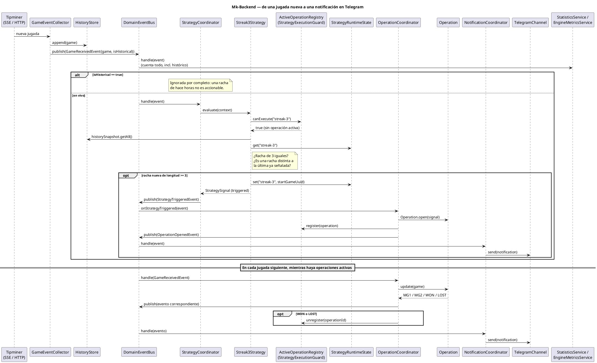

# Mk-Backend — Motor de Análisis BacBo

Motor de procesamiento de eventos en tiempo real que analiza las jugadas de **BacBo** (Evolution, vía [Tipminer](https://tipminer.com)), detecta patrones de racha, simula operaciones de apuesta con martingala y notifica los resultados por Telegram.

No es un CRUD: todo el sistema gira alrededor de un único disparador — **llega una jugada nueva** — y se comunica internamente mediante un bus de eventos de dominio, sin que ningún componente conozca a otro directamente.

Para el detalle completo de la arquitectura (capas, decisiones de diseño, análisis de rendimiento) ver [`ARCHITECTURE.md`](./ARCHITECTURE.md). Para el contrato de la API de Tipminer, ver [`API.MD`](./API.MD).

## Qué hace

1. Escucha las jugadas de BacBo en vivo (SSE) y carga un historial inicial (HTTP).
2. Evalúa estrategias sobre ese historial — hoy, `Streak3Strategy`: cuando una racha de 3 resultados iguales (PLAYER o BANKER) aparece, recomienda apostar al resultado opuesto.
3. Abre una operación simulada con hasta 2 pasos de martingala (MG1, MG2) y la sigue hasta que gana o pierde.
4. Notifica cada evento relevante (apertura, martingala, victoria, derrota) por Telegram.
5. Lleva estadísticas y métricas del motor completo, incluyendo el historial cargado al arrancar.

**Salvaguardas del motor de estrategias:**
- Nunca hay dos operaciones activas simultáneas para la misma estrategia (`StrategyExecutionGuard` / `ActiveOperationRegistry`).
- Una misma racha nunca genera más de una señal, sin importar cuánto se extienda ni si la operación anterior ya se resolvió — solo una racha nueva (cortada por un TIE o un cambio de ganador) vuelve a habilitar la señal (`StrategyRuntimeState`).

## Requisitos

- Node.js >=22 (usado en desarrollo: v24; ver `engines` en `package.json`)
- pnpm
- Docker (opcional, solo si vas a correr o desplegar el contenedor)

La aplicación es agnóstica a dónde corre: no asume ningún proveedor de
infraestructura. Solo necesita las variables de entorno de la siguiente
sección y un puerto disponible — puede correr con Node directo, con Docker,
o desplegada en cualquier plataforma (ver [Despliegue](#despliegue-en-cualquier-proveedor)).

## Ejecución local

```bash
pnpm install
cp .env.example .env   # completar TELEGRAM_BOT_TOKEN y TELEGRAM_CHAT_ID
pnpm start:dev
```

### Variables de entorno

| Variable | Descripción |
|---|---|
| `PORT` | Puerto HTTP del servidor (Fastify). Default `3000`. |
| `TELEGRAM_BOT_TOKEN` | Token del bot de Telegram (se obtiene con `@BotFather`). |
| `TELEGRAM_CHAT_ID` | Id del chat/grupo donde el bot envía las alertas. |
| `TIPMINER_BASE_URL` | Base de la API pública de Tipminer. Trae un valor por defecto. |
| `TIPMINER_PROVIDER_ID` | uuid de la mesa Bac Bo en Tipminer. Trae un valor por defecto. |
| `TIPMINER_TIMEZONE` | Timezone usada al pedir el historial. Opcional. |
| `TIPMINER_API_KEY` | Reservado para cuando la API deje de ser pública; hoy no se usa. |

Ver `.env.example` para más detalle.

### Scripts

| Comando | Qué hace |
|---|---|
| `pnpm start:dev` | Levanta el servidor en modo watch. |
| `pnpm build` | Compila a `dist/`. |
| `pnpm start:prod` | Corre el build compilado (`node dist/main.js`). |
| `pnpm test` | Corre la suite de tests (Jest). |
| `pnpm lint` | ESLint + Prettier. |

## Ejecución con Docker

No hace falta tener Node ni pnpm instalados en la máquina: el `Dockerfile`
(multi-stage: instala dependencias, compila, arma una imagen final liviana
sin herramientas de build, corre como usuario sin privilegios) resuelve
todo.

```bash
docker build -t bacbo-analysis-engine .
docker run --rm -p 3000:3000 --env-file .env bacbo-analysis-engine
```

O con Docker Compose (un solo servicio, sin dependencias externas como base
de datos):

```bash
docker compose up -d --build
```

La imagen expone un healthcheck contra `GET /healthz`, útil tanto para
`docker ps` como para cualquier plataforma que necesite verificar que el
contenedor está sano.

## Despliegue en cualquier proveedor

La aplicación no asume ningún proveedor específico. Cualquier plataforma
que sepa construir y correr un `Dockerfile` (o, alternativamente, un
proceso Node.js) funciona sin cambios en el código:

- **Build**: `docker build .` (o, sin Docker: `pnpm install --frozen-lockfile && pnpm build`).
- **Start**: el `CMD` de la imagen (`node dist/main.js`), o `pnpm start:prod` si el proveedor construye a partir del código fuente en vez de una imagen.
- **Puerto**: la app escucha en `0.0.0.0` y en el puerto de la variable `PORT` (por defecto `3000`) — solo hay que mapear el puerto que la plataforma exponga a esa variable.
- **Health check**: `GET /healthz` responde `200` con un snapshot del estado del motor; sirve para el health check de cualquier plataforma (Railway, Render, Fly.io, Kubernetes, etc.).
- **Variables de entorno requeridas**: ver la tabla más arriba. `TELEGRAM_BOT_TOKEN`/`TELEGRAM_CHAT_ID` son las únicas realmente necesarias para operar en producción; el resto trae valores por defecto.
- **Shutdown**: la app escucha `SIGTERM`/`SIGINT` (`app.enableShutdownHooks()`) y cierra la conexión SSE limpiamente antes de salir — compatible con el ciclo de vida de redeploy de cualquier orquestador.

### Ejemplos opcionales por proveedor

Estos ejemplos son **puramente opcionales**: ninguna plataforma que no sea
la nombrada los lee ni los necesita, y borrarlos no afecta en nada al resto
del despliegue. Ninguno de los dos requiere Docker instalado en tu máquina
ni en la plataforma — ambos usan el runtime nativo de Node (pnpm install +
build + start), igual que "Ejecución local".

- **Railway** — `railway.json` en la raíz (formato propio de Railway, solo lo lee Railway): fija `builder: NIXPACKS` y `startCommand: pnpm start:prod`. Solo hace falta conectar el repo y cargar `TELEGRAM_BOT_TOKEN`/`TELEGRAM_CHAT_ID` en su dashboard.
- **Render** — `render.yaml` en la raíz (Blueprint de Render, ver [su spec](https://render.com/docs/blueprint-spec)): fija `runtime: node`, build/start commands y `healthCheckPath: /healthz`. Al crear el Blueprint en Render (desde su dashboard, apuntando a este repo), te va a pedir `TELEGRAM_BOT_TOKEN`/`TELEGRAM_CHAT_ID` — nunca se guardan en el repo.
- **Coolify / Dokploy / Easypanel / Fly.io / DigitalOcean App Platform**: todas soportan "build desde Dockerfile" de forma nativa — basta con apuntarlas a este repo, sin configuración adicional. Esta es la única ruta que sí usa el `Dockerfile`.
- **VPS (Ubuntu/Debian, etc.)**: instalar Node 22+/pnpm y correr `pnpm install --frozen-lockfile && pnpm build && pnpm start:prod` (idealmente detrás de un supervisor de procesos, p. ej. `systemd` o `pm2`), o instalar Docker y correr `docker compose up -d --build` si preferís esa vía.

## Flujo del sistema



Pega el bloque anterior en [PlantUML Online](https://www.plantuml.com/plantuml) (o cualquier visor/plugin de PlantUML) para verlo renderizado.

## Estructura del proyecto

```
src/
├── core/            TypeScript puro, sin NestJS, sin dependencias de otras capas.
├── application/      Orquestación (coordinadores, servicios). Depende solo de core.
├── infrastructure/    Integraciones externas (Tipminer, Telegram). Depende de core y application.
└── e2e/              Test end-to-end del pipeline completo, sin la API real.
```

Detalle completo de capas, eventos, módulos NestJS y decisiones de diseño en [`ARCHITECTURE.md`](./ARCHITECTURE.md).
