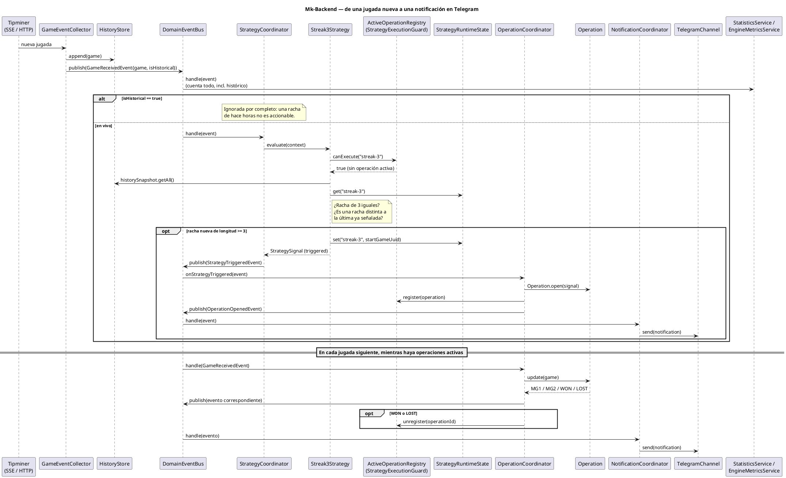

# Mk-Backend — Motor de Análisis BacBo

Motor de procesamiento de eventos en tiempo real que analiza las jugadas de **BacBo** (Evolution, vía [Tipminer](https://tipminer.com)), detecta patrones de racha, simula operaciones de apuesta con martingala y notifica los resultados por Telegram.

No es un CRUD: todo el sistema gira alrededor de un único disparador — **llega una jugada nueva** — y se comunica internamente mediante un bus de eventos de dominio, sin que ningún componente conozca a otro directamente.

Para el detalle completo de la arquitectura (capas, decisiones de diseño, análisis de rendimiento) ver [`ARCHITECTURE.md`](./ARCHITECTURE.md). Para el contrato de la API de Tipminer, ver [`API.MD`](./API.MD).

## Qué hace

1. Escucha las jugadas de BacBo en vivo (SSE) y carga un historial inicial (HTTP).
2. Evalúa estrategias sobre ese historial — hoy, `Streak3Strategy`: cuando una racha de 3 resultados iguales (PLAYER o BANKER) aparece, recomienda apostar al resultado opuesto.
3. Abre una operación simulada con hasta 2 pasos de martingala (MG1, MG2) y la sigue hasta que gana o pierde.
4. Notifica cada evento relevante (apertura, martingala, victoria, derrota) por Telegram.
5. Lleva estadísticas y métricas del motor completo, incluyendo el historial cargado al arrancar.

**Salvaguardas del motor de estrategias:**
- Nunca hay dos operaciones activas simultáneas para la misma estrategia (`StrategyExecutionGuard` / `ActiveOperationRegistry`).
- Una misma racha nunca genera más de una señal, sin importar cuánto se extienda ni si la operación anterior ya se resolvió — solo una racha nueva (cortada por un TIE o un cambio de ganador) vuelve a habilitar la señal (`StrategyRuntimeState`).

## Requisitos

- Node.js (usado en desarrollo: v24; ver `@types/node` en `package.json` como referencia)
- pnpm

## Cómo correrlo

```bash
pnpm install
cp .env.example .env   # completar TELEGRAM_BOT_TOKEN y TELEGRAM_CHAT_ID
pnpm start:dev
```

### Variables de entorno

| Variable | Descripción |
|---|---|
| `PORT` | Puerto HTTP del servidor (Fastify). Default `3000`. |
| `TELEGRAM_BOT_TOKEN` | Token del bot de Telegram (se obtiene con `@BotFather`). |
| `TELEGRAM_CHAT_ID` | Id del chat/grupo donde el bot envía las alertas. |
| `TIPMINER_BASE_URL` | Base de la API pública de Tipminer. Trae un valor por defecto. |
| `TIPMINER_PROVIDER_ID` | uuid de la mesa Bac Bo en Tipminer. Trae un valor por defecto. |
| `TIPMINER_TIMEZONE` | Timezone usada al pedir el historial. Opcional. |
| `TIPMINER_API_KEY` | Reservado para cuando la API deje de ser pública; hoy no se usa. |

Ver `.env.example` para más detalle.

### Scripts

| Comando | Qué hace |
|---|---|
| `pnpm start:dev` | Levanta el servidor en modo watch. |
| `pnpm build` | Compila a `dist/`. |
| `pnpm test` | Corre la suite de tests (Jest). |
| `pnpm lint` | ESLint + Prettier. |

## Flujo del sistema



Pega el bloque anterior en [PlantUML Online](https://www.plantuml.com/plantuml) (o cualquier visor/plugin de PlantUML) para verlo renderizado.

## Estructura del proyecto

```
src/
├── core/            TypeScript puro, sin NestJS, sin dependencias de otras capas.
├── application/      Orquestación (coordinadores, servicios). Depende solo de core.
├── infrastructure/    Integraciones externas (Tipminer, Telegram). Depende de core y application.
└── e2e/              Test end-to-end del pipeline completo, sin la API real.
```

Detalle completo de capas, eventos, módulos NestJS y decisiones de diseño en [`ARCHITECTURE.md`](./ARCHITECTURE.md).
